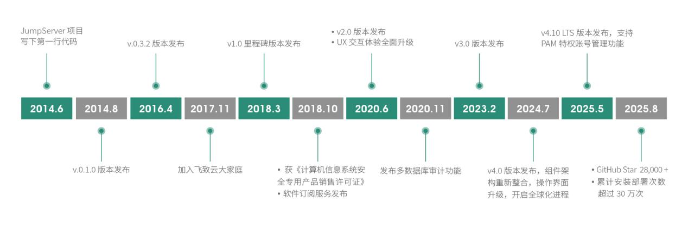
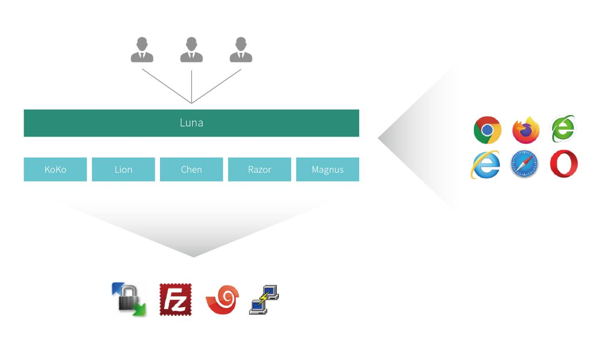
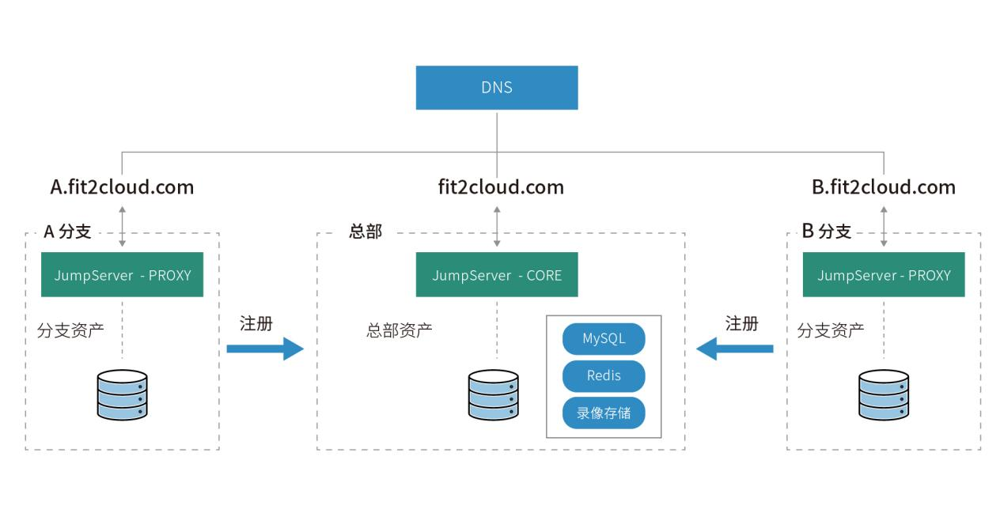
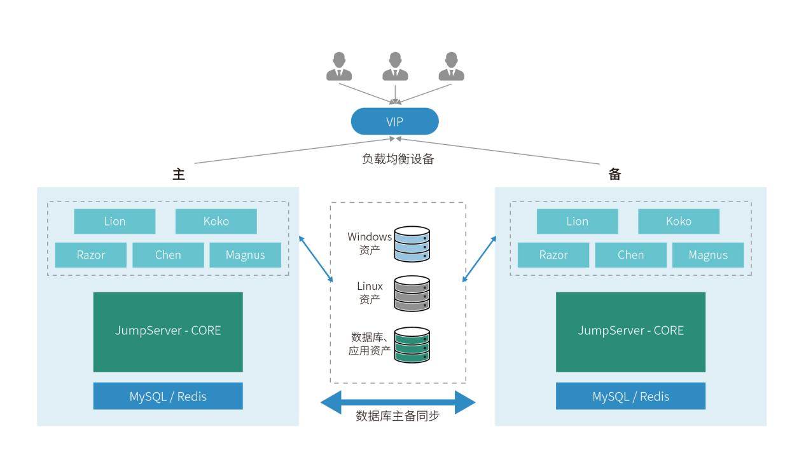
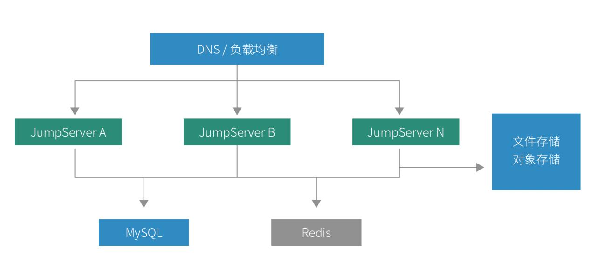
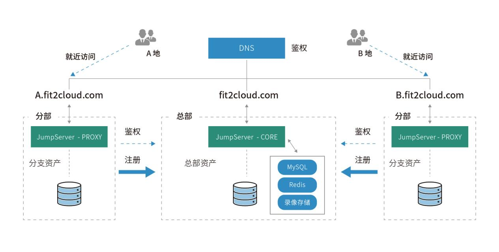

JumpServer 是广受欢迎的开源堡垒机，是符合 4A 规范（包含认证 Authentication 、授权 Authorization、 账号 Accounting 和审计 Auditing ）的运维安全审计系统。JumpServer 的后端技术栈为 Python / Django，前端技术栈为Vue.js / Element UI，遵循Web 2.0规范。

与传统堡垒机相比，JumpServer 采用了分布式架构设计，可灵活扩展、水平扩容。 JumpServer 还采用了领先的容器化部署方式，并且提供体验极佳的纯浏览器化 Web Terminal。产品交互界面美观、用户体验优异，同时支持管理多种资产类型，满足企业在数字经济时代下的运维安全审计需求。针对企业用户等级保护的要求，JumpServer 堡垒机已经获得公安部颁发的“计算机信息系统安全专用产品销售许可证”，助力企业快速构建身份鉴别、访问控制、安全审计等方面的能力，为企业通过等级保护评估提供有效支持。

## 4.1 JumpServer 的发展历程

由于日常运维管理工作的需要，JumpServer 开源项目的创始人老广（广宏伟）于 2014 年 6 月写下了 JumpServer 项目的第一行代码，并于当年 8 月在代码托管平台 GitHub 上发布了JumpServer 项目的首个版本（v0.1版本）。从 2014 年至今，11 年的时间里，JumpServer 每一年都有不同的变化，始终保持着高速演进的状态。JumpServer 开源项目发展的重要事件如图 5 所示。

图5 JumpServer 开源项目发展历程

JumpServer 项目从诞生之日起就对外开源。整个项目坚持“基于开源、拥抱开源和超越开源”的理念持续运营。项目中的大部分组件优先选择已经成熟的主流开源组件构建，将项目主要精力放在解决用户在堡垒机使用场景中的真实痛点之上。

2017 年 11 月，JumpServer 在加入飞致云大家庭后，项目获得更多的资源支持，并且开始坚持每月发布一个新版本，得到了越来越多社区用户和企业客户的认可。截至 2025 年 8 月，JumpServer 在 GitHub 上的 Star 数量超过 28,200 个，累计安装部署次数已经超过 300,000 次，成为业内具有最广泛安装基础的堡垒机。

## 4.2 JumpServer 的架构设计

JumpServer 充分吸收了过去多年互联网产品的发展经验，在项目早期就采纳了分层解耦的设计理念。JumpServer 的产品架构如图6 所示。

图6 JumpServer 的产品架构

从图 6 可以看出，JumpServer 产品从下至上可以分为存储层、数据层、核心层、接入层和负载层，包括 MySQL / Redis、CORE、KoKo / Lion / Chen / Razor / Magnus / Tinker / Panda、Luna 等核心组件。

■ 存储层 用于产品的各种数据存储（包括元数据及各种审计数据），存储可以是本地存储，也可以是传统 SAN 存储、文件存储或者对象存储等；

■ 数据层 采用 MySQL 数据库存储产品中的用户、资产、授权等核心数据，并使用 Redis 提供对核心数据的访问加速，提升用户的访问体验；

■ 核心层 用于对用户、资产和授权等核心数据进行处理，并提供相应的管理控制台。位于该层的 CORE 组件使用 Django Class Based View 风格开发，支持 RESTful API 接口；

■ 接入层 负责接入来自终端客户（Web 终端或者传统客户端）的连接请求。JumpServer 根据接入的连接类型提供不同的接入组件。其中，KoKo 组件实现了 SSH Server 和 Web Terminal Server，提供 SSH 和 WebSocket 接口，以方便用户通过 Web 端和传统 SSH 客户端登录使用。JumpServer 的 Lion 组件和 Razor 组件实现了 RDP 连接功能，其中 Lion 组件提供纯 Web 方式的图形化界面连接能力，Razor 组件提供 RDP 客户端连接能力。JumpServer 也为数据库提供了 Magnus 接入组件，支持以数据库代理直连的方式连接数据库，用户可以使用任意数据库管理工具（例如 Navicat、SQLyog 等）进行直连操作。Chen 组件支持浏览器图形化连接管理数据库。Tinker 组件是基于 Windows 操作系统的应用发布连接管理。Panda 组件提供了基于 Linux 的虚拟应用服务，用户可以充分利用 Panda 组件提供的容器化技术，实现对虚拟应用的高效调度和管理。另外，接入层还提供纯 Web 模式的接入，JumpServer 为此设计了一个纯浏览器版本的终端，即 Luna / Lina 组件；

■ 负载层 承载用户接入流量的负载均衡。用户可以选择纯软件的负载均衡方案（例如 Nginx），或者传统的硬件负载均衡设备（例如 F5）。

## 4.3 JumpServer的功能列表

介绍了 JumpServer 的产品架构设计后，我们来总结一下 JumpServer 所提供的堡垒机具体功能（如表 2 所示）。

注：部分功能仅在 JumpServer 堡垒机企业版提供。

表2 JumpServer 堡垒机功能列表

| 类别 | 功能 | 说明 |
| ---- | ---- | ---- |
| 身份验证 (Authentication) | 登录认证 | LDAP / AD 认证；CAS 认证；Passkey 认证；RADIUS 认证；OpenID / OAuth / SAML2；SSO 对接；扫码登录（企业微信、钉钉、飞书、Lark）；Slack 认证；LDAP HA 认证；**X-Pack** |
| 身份验证 (Authentication) | MFA 认证 | OTP 认证；RADIUS 二次认证；人脸识别二次认证；短信认证（阿里云、腾讯云、华为云、CMPP、自定义平台）；**X-Pack** |
| 身份验证 (Authentication) | 登录复核 | 用户登录 JumpServer 系统行为受管理员监管与控制；**X-Pack** |
| 身份验证 (Authentication) | 登录限制 | 控制登录来源 IP（黑 / 白名单）；控制登录时间段；复核用户登录时间段；**X-Pack** |
| 身份验证 (Authentication) | 角色管理 | 基于角色的访问控制（RBAC）；**X-Pack** |
| 授权控制 (Authorization) | 多维度授权 | 对用户、用户组、资产、资产节点、账号进行授权 |
| 授权控制 (Authorization) | 资产授权 | 树状结构展示；节点/资产灵活授权；继承父节点授权 |
| 授权控制 (Authorization) | 动作授权 | 上传 / 下载 / 删除 / 连接 / 会话分享；RDP 剪贴板复制粘贴控制 |
| 授权控制 (Authorization) | 时间授权 | 限制授权资产的使用时间段 |
| 授权控制 (Authorization) | 命令过滤 | 控制授权账号执行的命令 |
| 授权控制 (Authorization) | 文件管理 | SFTP 上传 / 下载；Web SFTP 管理 |
| 授权控制 (Authorization) | 协议授权 | 控制连接协议访问 |
| 授权控制 (Authorization) | 工单管理 | 登录行为控制；资产工单申请；二级审批流程；**X-Pack** |
| 账号管理 (Accounting) | 账号列表 | 查看所有账号信息 |
| 账号管理 (Accounting) | 账号模版 | 支持账号模版快速生成与关联；**X-Pack** |
| 账号管理 (Accounting) | 账号推送 | 定期推送账号到资产 |
| 账号管理 (Accounting) | 账号发现 | 定期收集主机用户 |
| 账号管理 (Accounting) | 账号备份 | 定期备份账号信息；邮件或 SFTP 发送（加密）；**X-Pack** |
| 账号管理 (Accounting) | 账号存储 | HashiCorp Vault、Azure Key Vault、AWS Secrets Manager；**X-Pack** |
| 账号管理 (Accounting) | 账号改密 | 定期批量修改账号密码；多种密码策略；**X-Pack** |
| 安全审计 (Auditing) | 会话审计 | 在线 / 历史会话审计；支持水印 |
| 安全审计 (Auditing) | 录像审计 | 操作录像回放；上传至公有云 |
| 安全审计 (Auditing) | 命令审计 | 命令审计；高危命令告警 |
| 安全审计 (Auditing) | 文件传输 | 文件上传 / 下载审计 |
| 安全审计 (Auditing) | 实时监控 | 管理员实时监控并可中断 / 暂停 |
| 安全审计 (Auditing) | 登录日志 | 登录行为审计；同步至 Syslog |
| 安全审计 (Auditing) | 操作日志 | 用户操作行为审计 |
| 安全审计 (Auditing) | 改密日志 | 修改密码行为审计 |
| 安全审计 (Auditing) | 作业/活动日志 | 自动化任务记录；资源活动时间线 |
| 其他 (Others) | 资产同步 | 公有云/私有云 23 平台自动同步；局域网发现；**X-Pack** |
| 其他 (Others) | 远程应用 | 管理远程应用；支持 Navicat、Workbench 等；**X-Pack** |
| 其他 (Others) | 虚拟应用 | Linux 远程应用发布机；**X-Pack** |
| 其他 (Others) | 作业中心 | 批量命令、脚本、Playbook |
| 其他 (Others) | 个性化设置 | 自定义 LOGO 与主题；**X-Pack** |
| 其他 (Others) | 数据库连接 | MariaDB、MySQL、Redis、MongoDB、PostgreSQL、Oracle、SQL Server、ClickHouse、DB2、达梦；**X-Pack** |
| 其他 (Others) | RDP 连接 | 高清晰度 RDP；**X-Pack** |
| 其他 (Others) | 录像云存储 | Amazon S3、COS、OSS、OBS、Ceph、Swift、Azure；**X-Pack** |
| 其他 (Others) | Kubernetes 管理 | K8s 运维审计 |
| 其他 (Others) | 批量传输 | 批量文件传输 |
| 其他 (Others) | 智能问答 | GPT、DeepSeek 模型 |
| 其他 (Others) | 多语言支持 | 简体/繁体中文、英语、俄语、日语、韩语、葡萄牙语、西班牙语等 |
| PAM (特权账号管理) | 特权账号管理 | 账号发现 / 批量推送 / 账号备份 / 集成第三方系统；账号改密与风险检测；**X-Pack** |

从上表可以看出，JumpServer 提供了运维安全审计产品所需要的完整“4A”能力，能够全面满足企业用户的日常运维安全审计需求。除此之外，JumpServer 还提供了大量的高级功能，以适应堡垒机产品使用环境的剧烈变化，并且有效提升用户的使用体验。

## 4.4 JumpServer的核心优势

作为一款诞生于 2010 年之后的堡垒机产品，JumpServer 自诞生之日起就致力于解决传统堡垒机所面临的多种挑战。与此同时，得益于互联网与软件领域技术与运营方式的发展，JumpServer 充分借鉴了其中的优秀经验，进而发展出了自己的特点和核心优势。具体来说，JumpServer 的核心优势主要体现在以下几个方面。

### 4.4.1 简单易用的访问体验

为了实现让更多人员以更低的门槛使用堡垒机进行资源安全运维的目标，JumpServer 从以下两个方面进行了访问体验的设计：

■ 加入独立的纯 Web Terminal 层，以适应“浏览器为王”的用户体验时代。对于传统 IT 运维人员来说，他们习惯于使用支持传统协议的客户端直接运行命令来操作设备，因此 JumpServer 支持遵循各种传统协议的客户端直连堡垒机进行运维操作。但同时随着越来越多的非典型运维人员加入到堡垒机的用户群体，堡垒机也需要降低使用门槛，并遵循这些用户最为熟悉的用户体验。显然，“拥有一个现代浏览器即可使用”是当前条件下最广泛的选择。为此，JumpServer 抛弃了传统堡垒机需要安装浏览器插件的模式，采用最新的 H5 技术，提供纯 Web 方式的 Luna 组件，支持字符界面、FTP 界面和图形界面的操作。其技术架构如图 7 所示；

图7 兼容纯浏览器和传统终端的访问模式

■ 简约而直白的 UI 设计风格。好的产品一定具有优秀的用户体验，并符合新时代互联网用户的使用习惯。JumpServer 从诞生之日起即采用开源模式运营，所有的功能设计均来源于社区用户的真实反馈。在规划 JumpServer v3.0 版本时，JumpServer 开源项目组和很多社区用户进行了深入访谈，在新版本中重新设计了用户、资产体系，并且请专业设计师对 JumpServer 的界面进行了全新的 UI设计，采用简约且直白的设计风格，仪表盘数据更加直观，并且重新调整了功能布局，大幅提升了用户的使用体验。

### 4.4.2 大规模分布式架构及多租户功能

作为近二十年来软件设计领域最为重要的发展方向之一，分布式架构已经在软件和互联网行业得到了广泛采纳，JumpServer  也从中获益。JumpServer 通过分布式的架构设计获得了充分的灵活性和可扩展性，具体体现在以下两方面：

■ 从 JumpServer 的架构设计可以看出，整个产品从接入层、核心层到数据层、存储层，每一层都是分层解耦的，并且每一层内部都可以实现水平扩展，以支持更高的负载需求；

■ JumpServer 采用的是容器化的部署方式和微服务架构，每一层的服务都是独立的容器服务，可单独启停。同时各个组件可按需部署在一套或者多套环境中，以保证高可靠性。

基于以上两点架构设计， JumpServer 在面临企业大规模资产并发访问，或者高度分散访问的时候，其灵活扩展的分布式架构就能够起到非常好的作用。这种架构的优势在于：

■ 当企业资产访问并发大规模增加时，通常会导致堡垒机负载无法支撑。结合 JumpServer 的架构设计，我们不难发现，资产并发的主要负载压力落在了接入端组件上。当并发访问增加的时候，这几个组件就会成为整个产品的性能瓶颈。为此，分层解耦架构中只需要在接入层部署更多的接入端节点，就可以快速应对高并发量的使用场景（如图 8 所示）；

图8 JumpServer 分布式部署架构

另外，在大规模应用场景下，JumpServer 除了在每一层均可横向扩展外，在存储层还支持采用对象存储服务来存储审计数据。对象存储以其极低的存储成本、无缝水平扩展的容量和简单的访问接口获得了众多用户的青睐，尤其是对于文件、视频这样的非结构化数据的存储。而堡垒机的审计数据恰好是需要大量视频和文件存储的场景。因此，JumpServer 支持对接对象存储，可以将海量的录像审计视频存储到对象存储中。一方面，这样可以大幅降低传统堡垒机解决方案中的存储成本；另一方面，还可以充分利用对象存储的数据全生命周期管理能力降低这些审计数据的运维管理负担；

■ 现阶段堡垒机的应用还有一个重要的场景，就是当前有很多企业拥有着分布非常分散的资产，且访问这些资产的人员也很分散。在这样的场景中，资产访问并发可能不是最大的问题，而访问链路的优化则是更加关键的因素。JumpServer 的分布式架构可以有效兼顾集中管理和分散就近访问。企业只需要为各地资产就近部署独立的接入层节点，并将接入节点统一接入到核心模块进行集中的资产授权管理（如图 9 所示）。这样一来，不同地点的用户访问资产时只需要和核心模块进行简单的授权交互即可，然后直接连接靠近目标资产的接入端进行访问。

图9 JumpServer 分散部署架构

另外，面对规模较大的集团 / 分、子公司 / 办事处的场景，JumpServer 还内置了多租户设计，让一台堡垒机可以“多家”使用。 JumpServer 在产品设计初期就参考了云计算的用户租户体系，充分考虑到了集团化、多部门的企业架构设计。JumpServer 集成的多租户体系，支持在统一管理的前提下实现管理权限的下放。租户管理员可以自己管理本部⻔的资产、用户与权限，实现一台堡垒机当作多台使用，既方便管理又可以节省成本。具体实现逻辑如图 10 所示。

图10 JumpServer 的多租户设计

### 4.4.3适配广泛资产类型

为了适配各种广泛类型的资产，JumpServer v3.0 版本在技术侧采用了很多抽象层设计，在设计之初，就采用了囊括传统主机、网络设备资产、数据库、Web、云服务和其他应用的集成一体化设计。

■ 传统主机和网络设备类型：对于传统设备的管理和审计，JumpServer 支持包括 SSH 字符协议、SFTP 文件传输协议、RDP / VNC 图形操作协议这些传统堡垒机所支持的协议。通过传统协议，JumpServer 即可实现对这些资产的统一管理和审计；

■ 数据库类型：JumpServer 支持对于 MySQL、MongoDB、PostgreSQL、SQL Server、Oracle 等主流数据库的运维操作审计。对于数据库的审计，JumpServer 不仅可以支持视频录像层面的记录，还支持 SQL 字符级的审计，用户可以直接通过日志记录来搜索数据库的操作日志；

■ 云资产类型：JumpServer 可以实现基于公有云 API 的云资产自动纳管。用户只需在 JumpServer 中设置云账号的 API 访问凭证，即可自动同步云上所有的主机资源信息。这对于拥有大量云资产的用户来说，省去了初次资产导入的繁重工作。在后期的运维工作中，当云资产发生变化时，JumpServer 亦可自动同步最新的资源信息，无需人工进行频繁维护。与此同时，在云资产同步的过程中，JumpServer 还支持基于云资产属性的自动分组策略。此外，对于以 Kubernetes 为代表的云原生基础设施资产，JumpServer 也可以对其进行运维操作审计的支持；

■ Web 和其他应用：JumpServer 还内建支持远程应用服务协议（即 RemoteApp功能）来针对单个应用进行运维操作审计，例如浏览器、Navicat以及其他应用，都能通过 JumpServer 进行操作录像的审计。

针对以上这些不同类型资产的集成，JumpServer v3.0 版本采用了一体化的设计方案，提供一致性的用户使用体验。JumpServer v3.0版本主要提供三种连接方式，即本地客户端（例如数据库客户端 Navicat、SSH 客户端、RDP 客户端）、Web端（数据库 GUI、Web CLI、Web RDP）及远程应用（基于 RemoteApp 实现代理）的方式。用户可根据其实际需求采用不同的连接方式。

### 4.4.4软硬兼顾的部署模式

作为一款开源软件产品，JumpServer 从诞生的第一天起就支持软件部署模式。JumpServer 的软件部署方案具有以下几个特点：

■ JumpServer 提供包括在线和离线两种模式的安装部署方式，方便用户按照自己的网络情况进行自由选择。整个安装过程支持一键安装部署，极大地降低了软件部署的难度。另外，软件的升级也可以通过和首次安装一样的方式高效进行；

■ 面向复杂环境与要求的企业客户，JumpServer 可提供商业化的高可用分布式部署解决方案，并且提供原厂企业级支持服务，以确保在复杂场景下的 JumpServer 部署方案真正切合用户的需求，并且能够达到软件在关键性环境中高效运营的实际要求。

考虑到部分客户的使用习惯以及部署环境的要求，JumpServer 也向企业用户提供商业化的软硬一体机解决方案。一体机设备采用和软件部署方案一致的软件版本，选择知名服务器厂商的硬件作为基础平台，并按照软件运行的实际资源消耗进行了硬件设备的配置调优。

除了提供软硬兼顾的部署方式，JumpServer 还支持软硬件混合的部署方式。比如在主备模式下采用主机硬件部署，备机采用软件部署的方式来完成部署。更多的 JumpServer 部署场景可以参见“4.5 JumpServer 的典型部署场景”章节。

### 4.4.5 开源开放的运营模式

如前所述，JumpServer 在其诞生早期就在代码托管平台 GitHub 上开源运营。开源运营模式所带来的“飞轮效应”在 JumpServer 身上得到了淋漓尽致的体现。下面我们就来看看开源模式给 JumpServer 带来了哪些独特的优势。

■ 优秀的社区品牌和知名度。目前，JumpServer 已经成为开源社区中排名第一的堡垒机产品，在 GitHub 代码托管平台上的 Star 数量已经突破 28,000 个，并在多次开源社区评选中被选为运维人员首选的堡垒机品牌。也正因如此，JumpServer 拥有了最为丰富的线上资源（包括问答、博客和视频等）以及最全面的技能培训机会。拥有 JumpServer 使用技能的技术人员也在应聘过程中拥有明显的优先权；

■ 广泛的社区人员参与开发迭代。目前，JumpServer 项目拥有超过百位的社区贡献者，他们通过在 GitHub 上提交 Issue、文档和代码等多种方式共同参与社区开发。JumpServer 开源项目组不断听取社区用户的意见和建议，并基于用户反馈不断增加新功能，这种广泛的社区参与让 JumpServer 一直保持着每月发布一个新版本的迭代效率。而通常情况下，传统堡垒机每半年甚至一年才会迭代一个新的版本；

■ 极高的产品采纳度。JumpServer 的开源属性使其在运维安全领域得以快速分发和普及。目前，JumpServer 已经拥有超过 30 万次的下载安装和投产使用。如此广泛的产品采纳度让 JumpServer 产品研发的功能需求能够一直来自于一线的用户，同时产品的功能和质量也能够在第一时间被最终用户所验证。

除此之外，JumpServer 基于 Swagger 协议提供了丰富的标准 RESTful API接口，可以和外部系统进行双向的数据交互，打破多个系统之间的数据孤岛。

## 4.5 JumpServer 的典型部署场景

为满足客户在不同场景下的运维安全审计需求，JumpServer 基于分布式架构提供针对不同场景的多种最佳落地实践，既可以平衡企业用户的实际使用需求，又满足了商务成本低、管理简单的要求。下面我们将详细阐述JumpServer的几种典型部署场景。

### 4.5.1传统的集中部署场景

对于资产较为集中，且资产数量和并发数量不是很高的用户，传统的集中式部署方案即可满足企业的日常需要。在生产环境中，为了保证业务的高可用性，需要部署高可用模式，以确保在某一节点发生故障时另一节点能够及时接管，不会影响业务的正常访问。用户可以根据业务的等级，采用主主模式或者主备模式来部署 JumpServer 堡垒机。

①主主模式：

图11 JumpServer 的“主 - 主”集中部署架构

部署说明如下：

■ 负载均衡节点：负载均衡节点可以为硬件设备 F5 或其他的软件形式，例如 HAProxy、Nginx 或公有云负载均衡 AWS ELB 等。可以配置主主模式，在并发较大时同时对外提供服务。既满足了高可用的特性，又能实现高并发下的负载均衡；

■ JumpServer 节点：需要至少两台服务器（虚拟机）用于部署 JumpServer 服务，包括 CORE、KoKo 、Lion、Razor、Chen、Magnus；

■ 数据库节点：具备高可用性的数据库，例如 RDS，也可以为配置好高可用的 MySQL、Oracle 数据库等；

■ 存储节点：建议使用共享文件存储或者是公有云的对象存储，用来存储视频录像以便于审计。

②主备模式：

图12 JumpServer 的“主 - 备”集中部署架构

部署说明如下：

■ 负载均衡节点：负载均衡节点可以为硬件设备 F5 或其他的软件形式，例如 HAProxy、Nginx 或公有云负载均衡 AWS ELB 等。可以配置主备模式，当主节点故障时，备节点能够快速自动切换，业务层对于故障无感知；

■ JumpServer 节点：需要至少两台服务器（虚拟机）用于部署 JumpServer 服务，包括 CORE、KoKo、Lion、Razor、Chen、Magnus；

■ 数据库节点：具备高可用性的数据库，例如 RDS，也可以为配置好高可用的 MySQL、Oracle 数据库等；

■ 存储节点：建议使用共享文件存储或者是公有云的对象存储，用来存储视频录像以便于审计。

### 4.5.2 多资产高并发下的分布式部署场景

对于一些复杂场景，例如用户资产数量较多、并发量较大的场景，JumpServer 需要通过水平扩展其接入接口节点实例来扩容其承载能力。这一场景的 JumpServer 部署架构如图 13 所示。

图13 JumpServer 的高并发部署架构

部署说明如下：

■ DNS / 负载均衡节点：负载均衡节点可以为硬件设备 F5 或其他的软件形式，例如 HAProxy、Nginx 或公有云负载均衡 AWS ELB 等，以提高负载与并发，可以配置为“主 - 主”或者“主 - 备”模式；

■ JumpServer节点：按照访问用户并发数及资产数量，评估出所需的 JumpServer 节点数量，并部署完整的 JumpServer 服务；

■ 数据库节点：具备高可用性的数据库，例如 RDS，也可以为配置好高可用的 MySQL 数据库等；

■ 存储节点：建议使用共享文件存储或者是公有云的对象存储，用来存储视频录像以便于审计。

### 4.5.3 分散资产下的分布式部署场景

当用户的资产处于非常分散的情况下，JumpServer 需要在部署完集中节点后，通过网域功能将其他分散的资产接入进来加以管理。这里以分散在多个不同公有云上的资产统一管理为例，JumpServer 的部署架构如图 14 所示。

图14 JumpServer 的分散多云资产部署架构

部署说明如下：

■ DNS / 负载均衡节点：采用 DNS 权重/负载均衡统一负载所有的 JumpServer 节点。负载均衡节点可以为硬件设备 F5 或其他的软件形式，例如HAProxy、Nginx 或公有云负载均衡 AWS ELB 等，以提高负载与并发，可以配置为“主 - 主”或者“主 - 备”模式；

■ JumpServer 节点：在每个公有云中部署完整的 JumpServer 应用，如果某个公有云内有多个 VPC，可采用网域功能解决 VPC 内网主机连接的问题；

■ 数据库节点： 具备高可用性的数据库，例如 RDS，也可以为配置好高可用的 MySQL 数据库等。所有 JumpServer 节点均采用同一个 RDS 作为数据库，同一个 Redis 作为缓存；

■ 存储节点：建议使用统一的共享文件存储或者是公有云的对象存储，用来存储视频录像以便于审计。

### 4.5.4“总部 - 分支机构”模式的分布式部署场景

当用户需要在“总部 - 分支机构”模式下进行分布式部署的时候，除了需要满足分布式部署的一般要求外，还会面临着不同分支机构各自独立管理和运维的需求。该场景下的JumpServer 部署架构如图 15 所示。
图15 JumpServer “总部 - 分支机构”统一部署架构

部署说明如下：

■ 在总部 / 核心机房部署 JumpServer 核心节点、数据库和存储节点等；

■ 在每个分支机构 / 分支机房环境中部署分节点，并向核心节点进行注册；

■ 通过七层 DNS 访问，规范与统一登录入口，实现资产的就近访问，采用 DNS 权重统一管理所有的 JumpServer 节点；

■ JumpServer 的核心节点：即部署完整的 JumpServer 应用；

■ JumpServer 的分支节点：即只部署KoKo / Lion / Razor / Chen / Magnus / Panda 节点；

■ 数据库节点：具备高可用性的数据库，例如 RDS，也可以为配置好高可用的 MySQL 数据库等；

■ 存储节点：建议使用统一的共享文件存储或者是公有云的对象存储，用来存储视频录像以便于审计。
