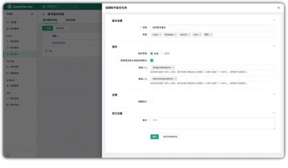
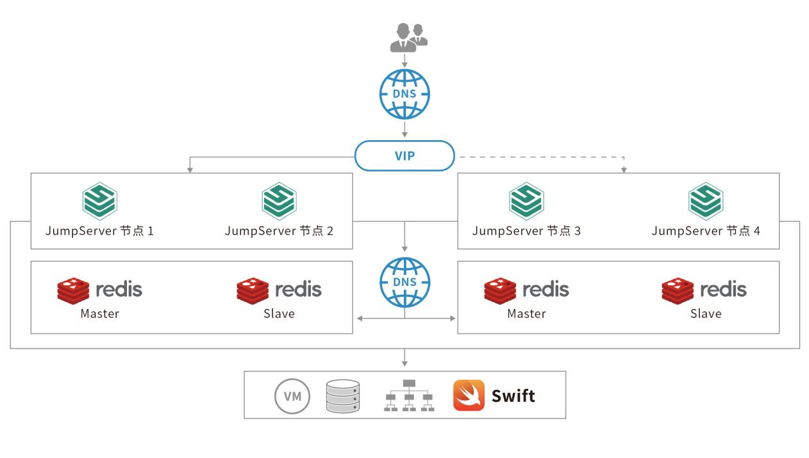

_面对体量庞大且仍在保持飞速增长的 IT 基础设施，作为顺丰的 IT 定向服务商，顺丰科技需要构建更加灵活、支持弹性扩张和高可用的运维安全审计体系。_

## 挑战：堡垒机要兼顾海量资产纳管与高可用

顺丰科技现实的运维管理需求，对堡垒机的能力提出了更高的要求：

■ 堡垒机需要支持多云基础设施。混合云的持续推广使用加大了 IT 基础设施管理的复杂程度。针对包含传统 KVM、私有云、公有云等类型的 IT 基础设施，企业需要堡垒机能够适配和纳管不同的 IT 组件，并进行统一的安全审计；

■ 堡垒机需要支持水平扩容。目前顺丰科技管理的虚拟机资产已达到数万规模，后续随着业务的增长，资产数量也将持续增长。庞大且快速增长的 IT 资产需要堡垒机在资产纳管方面更具可扩展性，并且能够应对突发性的业务需求；

■ 堡垒机需要具备成熟的高可用以及容灾部署架构。 高可用的分布式技术为支撑平台正常运行提供关键性的技术支持。容灾系统在出现断电、通信失败、硬件 / 软件错误等灾难时能够确保用户数据的安全性，并快速甚至不间断地提供应用服务。顺丰科技需要堡垒机提供持续可用、且快速容灾切换的能力，保障企业内部不间断的统一安全运维能力，有效支撑业务的持续运营；

■ 堡垒机服务能够支持海量资产的软件订阅服务模式。传统的堡垒机大都采用许可证销售模式，对于具有超大规模资产的用户来说，企业需要一次性地投入大额支出。一些堡垒机厂商虽然提供了软件订阅服务模式，却并没有针对企业拥有超大规模资产的实际场景提供更加灵活、经济的服务模式。从自身的需求出发，顺丰科技希望堡垒机能够提供针对海量资产纳管的软件订阅服务解决方案。

## 实现：JumpServer支持超大规模资产高效、安全运维

通过前期的技术选型，以及中期完整的功能测试和性能测试，顺丰科技对 JumpServer 堡垒机的产品设计、水平扩容能力、高可用和容灾部署架构、API接口体系等特性进行了充分验证，最终选择基于 JumpServer 堡垒机构建面向超大规模资产管理的安全运维审计系统。

附图38 顺丰科技运维安全审计系统架构

附图39 顺丰科技容灾系统架构

在实现大规模资产纳管的基础上，顺丰科技还基于 JumpServer 堡垒机企业版所附含的 X-Pack 增强包实现了对 IT 资产的多层级管理需求。对于登录用户的身份鉴别， JumpServer 堡垒机对接了顺丰科技的 LDAP 和 RADIUS，提供多因子认证功能，延续了顺丰科技之前身份令牌的使用习惯，有效避免了账号混用等安全隐患。

JumpServer 堡垒机还提供面向 Windows、Linux 系统的审计能力，可对每一位用户的每次操作进行记录和留痕，所有通过堡垒机的操作都会进行录像，并且对接了企业内部的 Swift 对象存储，防止录屏文件丢失。管理员可在事后对所有连接操作进行审计，有效杜绝了安全责任不清晰等问题。

此外，为了保障用户使用的便捷性，顺丰科技还在 JumpServer 堡垒机的操作细节上进行了很多优化，例如用户的创建、用户登录验证流程、LDAP 用户查询和导入、API 接口、资产信息过滤查询等，大幅提升了用户的使用体验。

## 突发：疫情期间经受远程办公考验

JumpServer 堡垒机在顺丰科技上线后不久便遇到了新冠肺炎疫情的突发情况。在这一特殊时期，堡垒机需要承载顺丰科技大量用户的远程办公需求，JumpServer 堡垒机成功经受住了一系列的严苛挑战，支持顺丰科技有效解决了远程安全运维问题。

大规模的远程办公从终端和链路的角度看，远程办公员工访问的身份、设备、网络都是很难可控的。站在企业服务器的角度，在远程访问时，企业服务暴露在公网上，传统的安全边界被打破，而仅仅依靠防火墙等传统安全防护措施难以抵御，可能面临机密信息外泄的风险。

顺丰科技通过 JumpServer 堡垒机对接其统一认证服务中心的多因子认证系统，同时提供了文件上传 / 下载、文本复制 / 粘贴、命令过滤器和中断危险会话等精细化的控制能力，防止核心机密信息的外泄。这样一来，认证体系不仅能为业务访问提供保障，还使得用户操作全过程可管可控，有效降低了信息安全管控的风险。

疫情期间，远程办公需求呈现指数级增长的态势，传统堡垒机应对如此爆发式的访问需求是十分困难的。 JumpServer 堡垒机通过分布式的架构设计，在保障现有服务平稳运行的前提下，快速进行水平扩容，为顺丰科技数千人的远程办公保驾护航。

附图40 JumpServer 堡垒机支持顺丰科技远程办公

## 收益：用户体验更优，实现成本更经济

通过部署并上线运营 JumpServer 堡垒机，顺丰科技获得的收益包括：

■ 获得了强大的可扩展能力和优秀的安全管控能力。 JumpServer 堡垒机采用了分布式的设计架构，不同组件可以实现独立部署，并进行横向扩展，提供强大的水平扩容能力。这种架构能够应对远程办公急速增长的访问需求，并且提供优质、稳定的服务。另外，基于多因子认证机制，上传/下载和复制/粘贴等权限控制能够更好地管控远程办公等场景下的安全运维风险；

■ 用户体验更优。 JumpServer 堡垒机支持用户通过浏览器登录，以及通过多种客户端登录，用户的传统使用习惯得以延续，为用户操作提供了充分的便利性。JumpServer 堡垒机企业版附含的 X-Pack 增强包提供多组织管理功能，支持混合云资产的一键导入，有效降低管理员的工作量；

■ 合理、可预期的建设成本，以及可靠的商业技术支持。借助 JumpServer 堡垒机企业版（旗舰版），顺丰科技实现了对海量资产的高效管理，同时支持高并发访问，服务价格不会因为资产数量的扩张而增加，有效控制安全运维体系的建设成本，并且可以持续获得 JumpServer 堡垒机原厂的专业技术支持，保证整体方案的平稳落地和高效运营。

在未来，顺丰科技将根据自身的 IT 建设规划，对 JumpServer 堡垒机运维管理体系进行持续建设，包括对远程办公模式的深入探索，以及与顺丰科技 Kafka 消息队列、顺丰云平台等系统进行对接，对用户、资产和授权信息实现流程化、自动化的管理，持续提升用户体验和工作效率。
