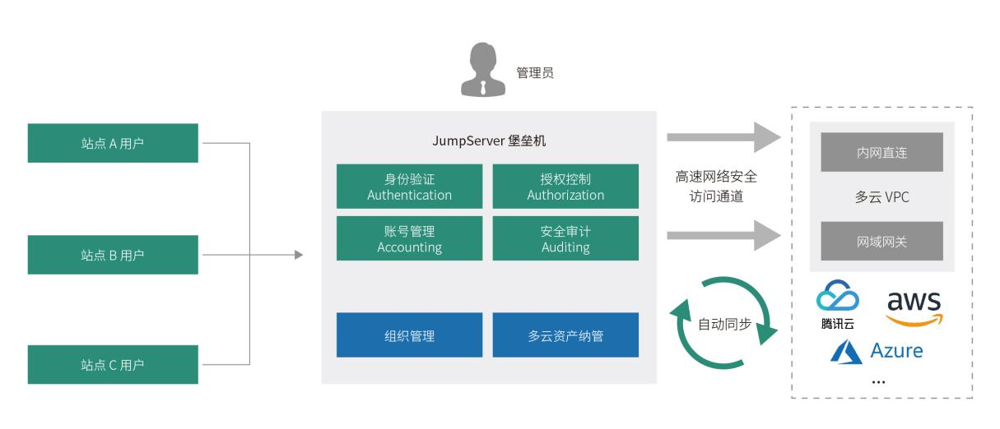
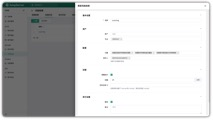

_锻造行业领先的游戏安全技术与运营能力。_

编者注：在2022年7月9日举办的“2022 JumpServer开源堡垒机城市遇见·深圳站”活动中，腾讯海外游戏安全运营负责人林鼎盛分享了题为《锻造行业领先游戏安全技术与运营能力》的主题演讲。以下内容根据本次演讲整理而成。

## 分级分类的安全管理思路

在很多情况下，我们进行安全管理所需的资源和时间都是有限的，为了在这些约束条件下更好地进行安全运维工作，就需要有“分级分类”的管理思维。例如，在做安全规划或处理安全风险之前，需要对相关需求风险做出识别，进行分级分类，集中重点资源解决高风险或优先级更高的事项。

腾讯海外游戏的业务遍布全球，团队也分布在海外多个地区。由于海外环境相对而言比较复杂，仅使用腾讯云不足以满足现有海外业务的需求。因此，在实际的工作场景中我们采纳了多云环境。在这种背景下，要建设好腾讯海外游戏的安全运维体系，“分级分类”的思维非常关键。这种思维能够很好地帮助我们识别并分类包括全球相关团队的云上资源、安全相关权限、相关策略等在内的各项业务。比如：用户类型需要分级分类用于更好地隔离权限；VPC 区域需要分级分类用于分离网络；区域团队需要做好分类便于分级管理。这样一来，我们就可以根据这些分类制定整体的实施策略。

基于复杂的海外云上安全环境，再结合对堡垒机开放性和安全方面的需求，经过综合选型对比后， JumpServer 作为一款开源产品，能够满足我们对安全性和开放性的需求。因此，我们最终选择 JumpServer 作为海外业务的堡垒机系统，来支撑腾讯海外游戏的运维安全工作。

## JumpServer：中国特色的堡垒机

我们在进行海外运维安全管理系统选型的时候发现，海外实际上并没有“堡垒机”这一概念，“堡垒机”是一种中国特色的产品。海外安全产品是以 PAM（Privileged Access Management，即特权访问管理）的概念来规划产品的，例如亚马逊 AWS 的 Session Manager。国内虽然也有类似于这些 PAM 概念的“特权账号”产品，例如“超级管理员（Root）密码”就属于特权账号，用户可以基于账号的生命周期以及权限生命周期，去定制相关的安全管理策略。

这种安全产品设计上的差异主要是由国内外管理理念的差异所导致的。国外人员如果对其进行相关监控，会被认为是限制其自由。而国内通常采取的都是比较严格的管控策略。这种观念的不同也进一步影响了国内外安全审计系统的不同发展方向。

■ 国内安全审计产品特点  一般情况下，国内的企业在整个安全方面的投入比重相对较少，因此会更倾向于选择功能丰富、能够一次性满足全部安全运维需求的产品。这样的需求催生出了具有更加全面功能的、具有“中国特色”的安全审计产品——堡垒机，更加符合国人的安全管理习惯；

■ 海外安全审计产品特点  与国内全程记录和统一管理的模式不同，海外的安全产品的发展路线更专注于某一个领域，分管安全审计过程中各个环节的日志记录，因此海外进行安全管理的时候就需要把不同的产品耦合，整合成一个安全方案进行使用。当然，这种模式对于公司整体分析能力的要求也是比较高的。

## 典型应用场景

下面通过四个主要应用场景来分享腾讯海外游戏在 JumpServer 堡垒机建设运维中的一些经验，在这些场景中也都体现了“分级分类”的思维。

### 场景一：构建层级架构管理体系，实现全球分区域灵活管理

对于组织架构，我们需要先做好整个多层级管理架构的规划，再结合相应的统一管理标准和操作流程，逐层逐级将相关权限下放到每一个组织。
 
附图41 腾讯海外游戏层级架构管理体系

场景特点：

■ 多层级管理架构，权限关系清晰；

■ 逐层分级管理，实现权限下放；

■ 统一标准，风险管理可控。

在全球协作方面，由于时差问题各国工作时间段不同，因此我们可以通过 JumpServer 堡垒机将相关权限下放到各个组织。甚至可以针对不同的站点组织以及不同的业务来下放对应审计的需求，实现出现问题或需求时 24 小时支持，从而达到整体全球管理的目的，提高了整体管理的效率和水平。

### 场景二：共建开源自主可控生态，融入企业安全运维整体框架

在这一场景中，我们首先需要根据一定维度对整体人员进行分类，同时对集群进行拆分，比如高敏感、低敏感等，并对云上 VPC 做好分类，将 JumpServer 的能力融入到整个安全运维框架中。
 
附图42 腾讯海外游戏安全运维整体框架

场景特点：

■ 统一资产、权限角色管理；

■ 对敏感资产实行网络隔离；

■ 集中日志，实现分析与审计。

在人员分类方面，比如正式运维、DBA 等人员具有生产环境的开发权限，而内部开发、外包、合作伙伴等人员则不应该具有此权限。通过 CMDB 和身份管理系统可以来统一资产、身份和权限决策的管理。

运维人员可以通过身份管理系统来进行身份决策以及权限管理的相关策略，判定是否允许其归属于高敏感集群，同时决定其是否具有权限去维护高敏感 VPC 中的相关资源，从而达到较好的敏感资产隔离效果。

当然，集群的细分层级和管控策略的强度可以结合自身实际业务情况来实现。在管控比较严格的公司内，可以通过 JumpServer 实现更加精细的划分。

### 场景三：与海外公有云无缝对接，更好适应云上环境

为了适配多云场景，腾讯海外游戏有不同的区域、不同的云，且设有不同的 VPC，需要打通 JumpServer 与这些 VPC 之间的通路。由于专线所花费的成本过高，因此在这种情况下，我们首先可以针对区域环境进行简单的拆分，针对每个区域环境业务量的不同采取不同的打通方式。

比如对重要性非常高、流量比较大的区域，就可以选择专线方式进行打通；对于其他重要性较低、流量较小的区域，可以选择 VPN 等方式接入。网络打通后，JumpServer 可适配内网直连以及网域网关的方式纳管资产。
 
附图43 腾讯海外游戏多云环境适配架构

场景特点：

■ 适配多云网络环境，支持网域网关方式连接内网资产；

■ 基于云 API 实现云资产自动纳管。

同时，在运维工作中也需要制定安全策略。基于安全层面考虑，我们并非所有VPC都对堡垒机开放，虽然 JumpServer 的安全性非常好，但是也难以保证绝对的安全。在这种情况下，我们可以选择只开通一个最为关键的通向内网的入口。这样一来，即使是在业务量或VPC 过多的场景下，甚至由于一些历史包袱原因导致网段冲突的发生，通过这种网络层级的方式进行接入就十分理想，充分利用了JumpServer 在多云环境中的适配能力。

另外，FIT2CLOUD 飞致云还有一款名为 CloudExplorer 的多云管理平台软件也具有这种多云管理的能力和优势。所以，JumpServer在组织多云产品的纳管适配方面是十分优秀的。

### 场景四：基于容器服务的全球多站点分布部署架构

对于堡垒机来说，如果在平时出现一些不稳定或故障的情况，并不会直接影响到线上环境的运行。但对于运维工程师来说，在我们需要对生产环境进行一些关键操作或者故障应急处理时，如果堡垒机出现故障，就会直接导致工程师无法及时操作，造成非常大的影响。

企业引入堡垒机是为了通过使用它获得良好的管理效果，但如果堡垒机本身成为管理系统中的瓶颈，就是本末倒置了。由于JumpServer 堡垒机在多云容器服务的适应方面表现良好，所以我们可以运用 JumpServer 所具有的容器特性，来为企业提供一个比较健壮的运行架构，保证系统整体运行的稳定性。
 
附图44 基于容器服务的全球多站点分布部署架构

场景特点：

■ 支持多云容器服务，灵活部署；

■ 可扩展性、高可用性。

在多云容器部署的场景下，即便堡垒机发生故障导致无法登录进行紧急处理，JumpServer 还为用户提供了最后的保障手段。这时候可以使用 JumpServer 的密码备份机制，通过应急方式直接登录环境，先处理好故障或应急解决的事项，再去逐步进行排查来解决堡垒机自身的问题，这个功能可以满足我们紧急维护的实际需求。

## 价值收益

在多云环境下分布式部署 JumpServer 后，腾讯海外游戏在全球资产的运维安全管理方面所获得的收益包括：

■ 深度适配全球多区域多云环境

针对我们资产全球多区域多云分布的特征，JumpServer 进行了多节点部署，用户可以选择就近接入，降低运维审计的延迟，具有良好的跨区容灾能力和高可用性。同时，JumpServer 具备统一的日志审计中心，支持高效的日常分析工作。通过 JumpServer 我们可以很容易地发现一些敏感的操作行为，帮助我们快速提升日常审计工作的效率；

■ 一体化安全高效的运维体验

JumpServer 作为一款被广泛应用的开源堡垒机，它的开放性是非常高的，用户可以在开源开放的场景下构建建立一个安全、自主、可控的管理系统。同时 JumpServer 堡垒机的易用性高，成本也比较低；

■ 专业的服务支持保障

长期以来，JumpServer 一直坚持着按月迭代的研发节奏。对于用户的需求，JumpServer 的专业团队迅速响应。整个团队秉持着“软件用起来才有价值，才有改进的机会”的态度，积极探索与用户合作创新的路径。
