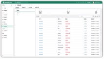

_JumpServer开源堡垒机助力万华化学提升系统安全运维能力。_

万华化学集团股份有限公司（以下简称为“万华化学”）是一家全球化运营的化工新材料公司，依托不断创新的核心技术、产业化装置及高效的运营模式，为客户提供更具竞争力的产品及解决方案。目前，万华化学的业务涵盖聚氨酯、石化、精细化学品、新兴材料四大产业集群，所服务的行业包括生活家居、运动休闲、汽车交通、建筑工业、电子电气、个人护理和绿色能源等。

作为一家全球化运营的化工新材料公司，万华化学目前拥有烟台、宁波、四川、福建、珠海、匈牙利六大基地及工厂，并持续扩能、优化，公司一体化基地版图呈现多点扩张的状态。此外，烟台、宁波、北京、北美、欧洲五大研发中心已完成布局，并在欧洲、美国、日本等十余个国家和地区设立了子公司及办事处。

## 客户挑战

业务的发展以及 IT 资产规模的迅速扩张，为万华化学的日常运维管理工作带来了一些现实的挑战：

■ 原有堡垒机系统无法满足现有需求

在使用 JumpServer 开源堡垒机之前，资产登录缺乏统一入口，难以集中管控，管理成本较高。同时，随着业务规模的不断发展，IT 资产不断增多，之前的堡垒机仅能够覆盖核心系统，且录屏日志记录保留的时间也较短，导致部分 IT 资产出现问题而无法进行追溯；

■ 分布式管理的需求

目前，万华化学拥有烟台、宁波、福建、珠海、眉山等生产基地，并将会在未来持续扩展，呈现全球化分布的状态。因此，针对多数据中心、多地域的 IT 资产的统一管理成为万华化学本轮堡垒机选型的一个重要考量维度；

■ 安全运维审计的需求

作为一家上市公司，万华化学在每年的各个时期都有内外部数据和资产审计的需求。无论是在总部层面，还是下辖的分支机构，对于相关 IT 资产都要求进行规范的运维安全审计。

这些现实工作中的困扰催生了万华化学对新一代堡垒机的需求，因此信息中心决定在企业内部环境中构建一套涵盖事前预防、事中监控、事后审计全流程且功能完善的安全管理平台，方便内部用户安全地连接和使用公司的 IT 资产。

在决定对堡垒机进行迭代更新之后，万华化学的信息中心团队也对比过很多其他品牌的堡垒机，最终选择 JumpServer 开源堡垒机的原因有以下几个方面：

1. JumpServer 功能强大，用户体验感好

传统堡垒机的使用门槛比较高，使用起来也不够轻便，往往需要在客户端安装插件来支持访问。JumpServer 提供了 Web Terminal的资产访问方式，用户可以直接通过浏览器访问需要运维的目标服务器，操作起来方便快捷；

2. JumpServer 支持分布式部署和高并发访问

JumpServer 具有非常高的可扩展性，在多数据中心的场景下也能够很容易地扩展连接组件来接入和管理其他数据中心的资产。而且JumpServer 还可以通过前端的负载均衡组件承载高并发量的访问，在资产规模快速扩张的情况下也能够很好地满足公司的业务发展需要。

而针对万华化学在堡垒机架构设计和实际部署等方面遇到的实际问题，也可以借助 JumpServer 客户成功团队的专业服务得以解决，确保了系统上线及运营的效率和可靠性；

3. JumpServer 支持对接云管平台

作为 FIT2CLOUD 飞致云的 CloudExplorer 多云管理平台的用户，万华化学可以从 CloudExplorer 多云管理平台和 JumpServer 的功能联动中获益。

CloudExplorer 多云管理平台中的堡垒机模块支持自动将云管平台上的资产、用户和账号同步到 JumpServer 堡垒机中，并且自动在 JumpServer 中创建对应的授权。用户在资源创建完成以后，一键即可连接资产，极大地提高了管理效率。同时也借此构建了从资源申请到配置变更，以及系统运维审计的虚拟机全生命周期的一体化协同管理运维审计体系。

## 解决方案

基于多基地、多数据中心的分布式特点，万华化学选择了分布式架构的堡垒机部署方式。目前，万华化学通过 JumpServer 纳管了内网中大量分布于不同地理位置的 IT 资产，外网通过 VPN 的方式接入内网进行连接访问。同时，还通过 JumpServer 与云管平台进行联动，构建了一体化协同管理平台，大大减轻了后期运维的压力，提高了整体的 IT 运维效率。

在实际使用 JumpServer 的过程中，用户可以通过 Web Terminal 访问 Linux 及 Windows 资产，支持实时监控及录像审计，并开启了 MFA 多因子认证功能，大大提升了系统的安全等级。同时，JumpServer 提供完备的 4A（即身份验证、授权控制、账号管理、安全审计）核心能力，为分布式的服务器、关键系统、数据库和安全设备等 IT 资产提供统一的安全管理保障。

另外，JumpServer 的集中管控系统账号功能可以有效管控运维人员有意或无意的危险操作行为，并且实现对所有操作会话的在线监控、实时阻断、日志回放、起止时间、来源用户、来源 IP、目标设备、协议 / 应用类型、命令记录、操作内容等行为进行记录，对用户行为进行追溯，有效保障系统运维的整体安全性。
 
附图46  JumpServer 在万华化学的部署架构

## 价值收益

上线 JumpServer 堡垒机后，万华化学信息中心团队的安全运维能力得到了显著的提升。而 JumpServer 的一些实用的功能设计，也让运维团队的工作效率进一步提高。整体上，JumpServer 开源堡垒机为万华化学的 IT 运营带来了非常多的价值收益。具体包括以下几方面：

■ 提升了用户体验。JumpServer 的操作界面美观直接，资产视图、Web 终端等界面简单明了，在实际使用的过程中较传统堡垒机的使用体验改善了很多；

■ 保障了系统运维的安全性。JumpServer 支持 MFA 二次认证等多种认证方式，并支持会话水印、多种密码策略等监控审计操作功能，规范了用户的操作行为，从多个维度确保 IT 系统运营的安全性；

■ 提高了运维管理的效率。在保障整体安全的前提下，JumpServer 所提供的密码代填、批量命令等功能提升了运维人员的工作效率，同时通过云管平台自动化的同步及创建授权，极大地降低了 IT 系统的管理成本；

■ 提升了安全管控的等级。通过使用 JumpServer 堡垒机，万华化学有效地扩大了 IT 资产审计的范围，并且审计可追溯的历史时长也增加了一倍，助力公司通过等保 2.0、ISO27001 等安全认证，同时符合相关的法律法规，满足上市公司的规范指引和行业要求。
