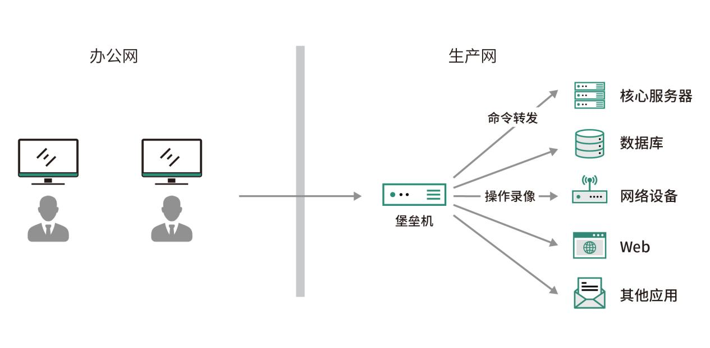
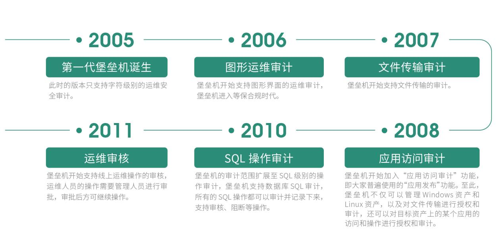

## 2.1 堡垒机的诞生

过去几十年来，伴随着信息技术的发展，信息化系统逐渐渗透到企业日常运营的方方面面，使得需要参与 IT 运维的人员越来越多。来自于企业内部人员或者第三方维护人员的技能水平参差不齐，用户误操作、恶意操作等行为所造成的信息安全事故日益增多，而此类安全事故往往会给企业造成极大的损失。因此，企业信息安全防护已经从单纯传统的网络安全防护逐步延伸到运维操作安全防护领域。

在这一背景下，侧重于运维安全审计的堡垒机应运而生。堡垒机是指对用户的操作进行权限控制和对操作行为进行审计的安全产品，属于身份与访问安全的范畴。

在企业 IT 系统运维的过程中，为了保障内部系统不受内外部入侵的破坏，运维安全审计系统通过访问控制、身份认证、账号管理、行为审计等多种信息安全技术，对网络设备、主机系统、应用系统的运维访问进行精细化管理，从而帮助企业对 IT 运维建立全面的、包含事前识别与规划、事中控制，以及事后审计在内的安全管理体系。

堡垒机的核心功能是“安全访问+操作审计”。要实现这一目标，则需要在终端设备和目标资产中间加一层协议转发节点，所有对目标资产的请求都要经过这一节点。该节点能够拦截非法访问，阻断不合规的危险命令，并对内部人员的所有操作进行审计监控，以便进行事后追溯。而以上所说的中间节点就是堡垒机，堡垒机在网络环境中的经典拓扑如图 1 所示。
 
图1 堡垒机运营逻辑拓扑图

## 2.2 堡垒机的发展历程

按照业界的普遍共识，堡垒机最早诞生于 2005 年前后。在过去接近二十年的时间里，堡垒机的发展经历了如下几个重要的时间节点，具体如图 2 “堡垒机发展简史”所示。
 
图2 堡垒机发展简史

在 2005 年以前，当运维人员需要登录到目标资产进行操作时，会在中间部署一台 Windows / Unix 的服务器作为跳板机（或者叫做前置机 )。所有的运维人员都需要先远程登录到跳板机，然后再从跳板机登录到其他服务器中进行运维操作。但跳板机只是为了解决用户集中登录的问题，并不能回答“谁在什么时间点登录了哪台服务器进行了什么操作”，所以一旦系统出现问题很难快速定位具体的原因和相关人员。另外，在这种模式下，后端目标资产的账号安全性也无法得到良好的保障，每个用户均能拿到目标资产的用户名和密码。

因此，市场需要用更新、更好的安全技术理念来实现运维操作管理。2005 年前后，堡垒机开始以一个独立的产品形态出现，并且陆续得到企业用户的广泛采纳。堡垒机的广泛部署有效降低了企业 IT 系统运维操作的风险，使得企业运维操作管理变得更加简单、更加安全。

## 2.3 等级保护推动堡垒机的发展

随着信息化技术的普及，国家对于信息化安全的重视程度越来越高。从 1994 年起，国家各级部门颁布了各种信息安全相关的法律法规，其中比较重要的几个事件如图3所示。

图3 信息安全法律法规大事件

我们经常听到的“等保”，即上文出现的信息系统安全等级保护。根据信息系统在国家安全、经济建设、社会生活中的重要程度，以及其一旦遭到破坏、丧失功能或者数据被篡改、泄露、丢失、损毁后，对国家安全、社会秩序、公共利益以及相关公民、法人和其他组织的合法权益的危害程度等因素，等级保护被划分为五个等级（如表 1 所示）。

表1 等级保护的划分

| 等级   | 划分说明 |
|--------|----------|
| 第一级 | 一旦受到破坏会对相关公民、法人和其他组织的合法权益造成损害，但不危害国家安全、社会秩序和公共利益的一般网络 |
| 第二级 | 一旦受到破坏会对相关公民、法人和其他组织的合法权益造成严重损害，或者对社会秩序和公共利益造成危害，但不危害国家安全的一般网络 |
| 第三级 | 一旦受到破坏会对相关公民、法人和其他组织的合法权益造成特别严重损害，或者会对社会秩序和社会公共利益造成严重危害，或者对国家安全造成危害的重要网络 |
| 第四级 | 一旦受到破坏会对社会秩序和公共利益造成特别严重危害，或者对国家安全造成严重危害的特别重要网络 |
| 第五级 | 一旦受到破坏后会对国家安全造成特别严重危害的极其重要网络 |

在以上的等级划分中，等保法规明确要求第三级及以上等级保护需要具备身份鉴别（ Authentication ）、访问控制（ Authorization ）、安全审计  （ Auditing ） 等运维安全审计的能力和措施。因此，等保的出现使得堡垒机在全国受监管的企事业单位及关系国计民生的重要行业内快速落地，同时也推动了堡垒机产品和技术的快速演进，让越来越多的客户认识到堡垒机在安全运维过程中所带来的价值。

## 2.4传统堡垒机面临的挑战
	
随着企业内部的安全需求和各种合规要求，堡垒机的市场空间被快速打开，产品和技术也得到了快速发展。但遗憾的是，进入 21 世纪的第二个十年后，堡垒机的产品和技术发展进入了明显的瓶颈期。与此同时，随着互联网技术及智能手机的快速普及，数字化转型已经深入到每个人生活的方方面面。对于企业来说，IT 系统的规模愈加庞大，更广泛的人群需要使用 IT 系统，企业对 IT 系统的依赖程度逐渐加深，这就导致企业信息安全部门对于堡垒机的需求也发生了巨大的变化。

这种变化主要体现在堡垒机所处的企业IT环境在进行深度变革的时候，具体可以从两个视角来观察：

① 堡垒机管理的目标资产端

■ 资产爆炸式增长，且频繁变更。企业的 IT 资产规模从几十台资产增长到几千台甚至上万台资产。资产的数量快速增长，使得资产和用户的管理难度呈现出指数级增长的态势。与此同时，资产的变更也日益频繁。之前企业内部上线一套系统后，一般是等到业务下线才会回收机器。但如今业务需求的多变导致业务系统需要频繁进行变更，扩容与缩容也让资产的变更更加频繁。尤其是这些年基于弹性和 API 设计的云基础设施快速进入企业内部，资产的规模变化和变更频率进一步加快；

■ 资产高度异构化。中国企业的 IT 架构在过去三十年间发生了巨变。基础设施层面从早期的物理机、 虚拟化到现在的私有云、 公有云、容器云等；数据库从之前的 DB2、SQL Server 到现在流行的开源数据库 MySQL、MariaDB、MongoDB 等；同时，在更广泛的人群依赖 IT 系统的同时，企业也引入了各种复杂的应用软件；

■ 资产分布范围广。互联网的兴起使得企业的业务不再受地域的限制，业务可以在全国乃至全球范围内广泛布局，这就使得企业由传统的集中式单一数据中心向多地分散的分布式数据中心布局转变。

② 堡垒机系统的使用端

■ 堡垒机使用端平台的变革。2010 年之后，互联网快速兴起，我们访问互联网的设备从早期的台式机、笔记本到现在随处可见的智能手机和平板电脑。操作系统也从早期的 Windows 系统到现在多样化的 MacOS、Linux、iOS、Android 系统等。堡垒机的使用端发生了巨大变化；

■ 堡垒机使用端人群的扩张。随着企业 IT 系统快速渗透到企业内部的方方面面，堡垒机使用的人群也已经从传统的 IT 专业运维人员扩张到大量的泛 IT 人群，包括开发测试人员、业务运营人员乃至公司的部分管理人员等。这些人群普遍缺少对于 IT 运维软件的使用经验，他们期待堡垒机的使用能够更加简单，并且对访问端的环境要求也可以更低一些。

这些外部环境的变化对于传统堡垒机而言是极大的挑战。具体体现在以下几个方面：

■ 复杂的访问端环境造成额外的维护成本。传统堡垒机方案中用户接入门槛高，维护成本也偏高。越来越多的企业需要堡垒机能够提供“传统客户端 + Web 接入”的双重访问模式，尤其对 Web 接入的需求越来越强烈。传统方案在 Web 接入方式上普遍采用较为原始的浏览器插件模式，导致大量的浏览器插件不匹配、用户无法升级浏览器等影响用户使用体验的问题，严重影响了堡垒机的接入访问效率；

■ 资产规模的快速增加带来的管理复杂度提升。传统的堡垒机是通过手动录入 IP 或者 Excel 表格进行资产导入，但是对于现在动辄几千甚至上万台的资产，如果需要人工录入，这种方式不仅效率低还很容易出错。而且在资产频繁变更的情况下，这样粗放的管理方式大概率会逐步发展到不可控的阶段；

■ 分散资产带来的管理成本增加。企业的 IT 资产分散在全国乃至全球各地，各个地区间网络连接的带宽和稳定性给堡垒机的日常管理带来了很多的不确定因素。在传统的架构中，部署在 A 地的堡垒机需要去管理 B 地的资产，一般是需要在 A 地和 B 地之间部署专线来解决。分支机构越多，机构之间的距离越远，往往会带来更高的管理成本。另外一种传统的解决方案是在每个区域购买一台堡垒机，多个区域组成一个大的集群，但这种方案不仅会造成大量的成本浪费，也会给管理上带来很多不必要的麻烦；

■ 审计对象的复杂化。当下 IT 技术的演进速度越来越快，在 IT 基础设施层面，Kubernetes 成为容器云建设的首选标准。随着一些新型数据库产品的出现，以及泛 IT 人群带来的各种应用软件，传统堡垒机所能支持的审计对象已经无法满足 IT 环境的新变化，需要将新出现的 IT 基础设施作为新的审计对象考虑进来。

因此，面对如今数字经济时代下的运维管理环境，传统的堡垒机解决方案在实际应用场景中的短板日趋明显。企业用户呼唤新一代堡垒机的出现，以应对当下运维安全审计的实际需要。
