JumpServer v4.10 LTS 版本是 JumpServer 产品演进历程中一个非常重要的版本。在这一版本中， JumpServer 以 PAM（Privileged Account Management，即特权账号管理）为核心需求进行架构升级，在完整保留并深度优化原有账号全生命周期管理功能的基础上，突破性地引入账号风险智能检测引擎与应用权限动态管理模块。

从这一版本开始，JumpServer 真正将“PAM（特权账号管理）”与“堡垒机审计”合二为一，通过 PAM 模块提供一整套高效的特权账号管理功能，包括自动发现、批量推送、密码备份、账号改密、风险检测以及与第三方系统的集成，在帮助企业简化账号管理流程、提升安全合规性的同时，有效降低企业实际部署与运维的成本。

## 7.1 PAM（特权账号管理）是什么?

PAM（特权账号管理），是组织信息安全体系中至关重要的一环，主要用于管理和监控具有高权限账号的用户访问权限。简单来说，PAM 就像是一个“超级管理员”，专门负责管理那些拥有高权限账号（例如 Root、Administrator、免密 sudo 账号等）用户的登录和操作行为，确保这些高权限账号的用户访问不会被滥用。对企业用户来说，PAM的核心价值包含以下几点：

① 增强系统安全性

■ 限制高危操作：PAM 可以对特权用户的行为进行严格限制，比如禁止某些高风险的操作（例如删除关键数据、修改系统配置等），从而降低因误操作或者恶意操作行为导致的安全风险；

■ 防止权限滥用：通过严格的权限分配和控制，PAM 可以防止特权用户滥用权限，比如防止用户访问不属于其权限内的敏感数据或者核心数据。 

② 简化管理

■ 集中管理权限：PAM 可以将所有特权账号的权限集中进行管理，不需要在每个系统中单独设置权限，大大降低了管理的复杂度；

■ 自动化操作：PAM 可以自动化一些常见的特权操作，比如定期更换密码、自动备份密码等，节省了管理员的时间和精力。

## 7.2 PAM 和堡垒机的关系

堡垒机，又被称为运维安全审计系统，主要具备统一运维访问入口、资产授权管控和全程审计录像等功能，帮助企业建立包含事前授权、事中监察以及事后审计在内的运维安全管理体系，满足企业运维安全合规要求。

由此可见，PAM 专注于特权账号的管理，注重特权账号的安全性；而堡垒机则更侧重于对运维访问的管理，注重系统运维操作的安全性。所以，PAM 和堡垒机在功能上有部分重叠，但在设计和定位上有着很多不一样的地方。具体的区别如下：

表3 PAM 和堡垒机的区别

| 对比维度 | PAM | 堡垒机 |
|----------|-----|--------|
| 管理对象 | 主要管理特权账号，这些账号通常拥有高权限，可以访问企业的核心系统和数据。 | 管理所有需要访问资产的用户和用户需要访问的资产，包括普通用户、特权用户、服务器、网络设备、数据库和 B/S 架构应用等，范围更广。 |
| 功能重点 | 主要关注特权账号的管理，包括权限分配、密码管理、操作审计等，重点是防止特权用户滥用权限，保护企业的核心资产。 | 主要关注对远程访问的管理和审计，能够实时监控所有用户的操作过程，记录下他们的每一个动作。如果系统出现问题，可以通过这些记录快速追溯原因，帮助管理员迅速定位问题。 |
| 应用场景 | 适用于对内部特权账号进行管理，特别是在企业内部有大量高权限账户需要严格管控的场景。 | 适用于需要安全运维并进行严格控制的场景，比如企业对外提供远程办公支持、外包人员访问内部系统、日常运维变更操作等场景。 |

所以，PAM 和堡垒机是网络安全中同样重要的工具，虽然它们的侧重点和应用场景有所不同，但是在实际使用中，很多企业会同时部署PAM和堡垒机，以实现更为全面的安全防护体系。

## 7.3 JumpServer 一体化 PAM 和堡垒机的优势

在传统方案中，很多企业为了实现更全面的安全防护，往往同时部署 PAM 与堡垒机，两个系统分别管理人、机、密。由于采用的是独立部署方式，PAM 和堡垒机无法共享同一套用户系统和权限策略，导致出现管理分散、运维复杂、成本高昂等问题。JumpServer v4.10 LTS 版本创新性地将堡垒机与 PAM 功能无缝整合，形成“访问控制+特权管理”的一体化解决方案，既能发现并管理特权账号，同时也能对运维操作进行审计管控，所有操作在一套 JumpServer 系统内实现，真正实现了全面、立体化的安全防护。 

表4 传统方案与 JumpServer“PAM + 堡垒机”一体化方案的对比

| 对比维度 | 传统方案：独立 PAM + 独立堡垒机 | JumpServer：一体化的 PAM + 堡垒机 |
|----------|--------------------------------|-----------------------------------|
| 产品部署 | PAM 系统与堡垒机系统各自独立，需要分别部署、扩容 | 单一产品，统一部署、统一扩容 |
| 用户管理 | PAM 系统与堡垒机需要分别维护用户、角色和权限 | 用户/角色/权限在同一平台内统一管理 |
| 界面与操作 | 切换系统、重复登录、学习成本高 | 一站式界面，自然串联特权发现 → 授权 → 审计 |
| 集成与 API | 两套 API，需要分别对接和维护 | 一套 API，即可完成特权账号发放、审计等 |
| 维护成本 | 双系统升级、双系统备份、双系统监控 | 单系统维护、单系统备份、单系统监控 |

## 7.4 JumpServer PAM 核心功能详解

结合最新 JumpServer v4.10 LTS 版本，我们来逐一介绍 JumpServer PAM 的核心功能，包括账号发现、账号推送、账号备份、账号改密、风险检测和应用管理。

① 账号发现

在企业环境中，资产数量一旦多了之后，手动管理账号几乎是不可能完成的任务。账号发现功能可以帮助管理员快速梳理资产中的所有账号情况，避免因遗漏高危账号而导致的安全隐患。

■ 自动扫描：支持定时或周期性扫描方式，对服务器、网络设备、数据库等资产的账号进行深度发现。系统能够自动识别资产中的账号信息，包括用户名、权限级别、所属用户组等，确保所有账号都被纳入管理范围；

■ 账号识别：按节点、指定资产快速定位未管理的高危账号。通过资产目录的可视化展示，管理员可以清晰地看到哪些资产存在未授权或高危账号，从而及时采取措施进行处理，一键删除未知账号。

图26 JumpServer 的账号发现功能

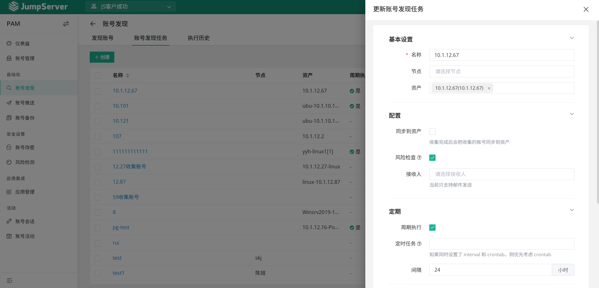

② 账号推送

在新资产上线或需要批量创建账号时，账号推送功能可以快速完成账号的创建和配置，避免了管理员手动创建账号的繁琐过程，同时也确保了账号的密码设置符合相关安全标准。

■ 集中下发：将自定义设置的账号和密码一键推送至目标资产，无需手动登录资产进行创建。管理员可以在 JumpServer 中统一配置账号密码生成策略，批量推送到多个资产中，大大提高了工作效率；

■ 密码策略：支持自定义复杂密码和密文类型。系统提供多种密码策略选项，例如密码长度、字符组合等，确保生成的密码符合相关安全要求。

图27 JumpServer 的账号推送功能

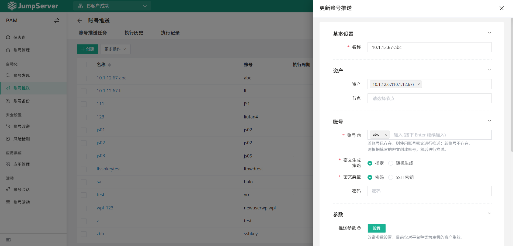

图28 JumpServer 自动化推送 MySQL 数据库账号

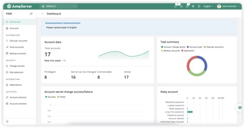

③ 账号备份

在企业中，无论特权账号还是普通账号的密码都是非常重要的资产，一旦丢失可能会导致严重的后果。账号备份功能可以确保在意外情况下快速恢复账号密码，同时提供双人密钥机制，满足企业的安全合规要求。

■ 密码备份：安全备份所有账号的最新口令至指定的邮箱或者服务器。备份文件采用加密存储，确保数据的安全性，且管理员可以设定备份的周期与时间点，保证每次操作后的密码能够被安全保存；

■ 双人密钥：提供双人解密机制，确保操作合规。只有经过双人密码组合后，才能解密备份文件，防止单人操作带来的风险。

图29 在 JumpServer 中创建账号备份任务

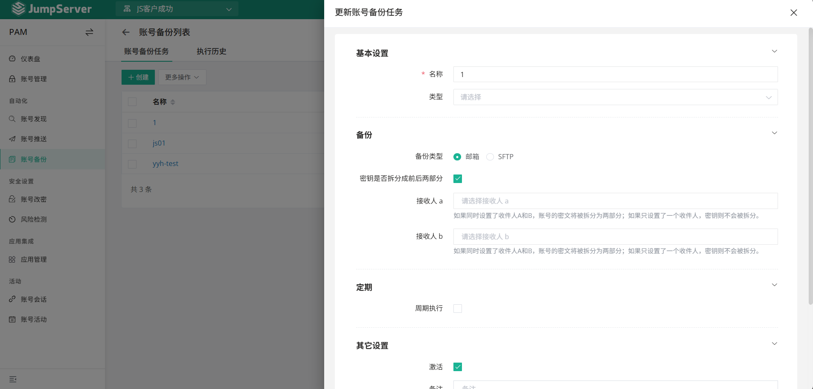

图30 JumpServer 的备份执行记录

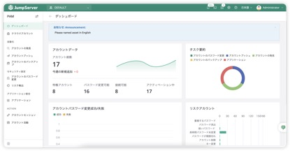

④ 账号改密

定期更换账号密码是企业安全管理的基本要求，但手动改密不仅效率低下，还容易出错。账号改密功能可以自动化完成密码的更新操作，同时确保密码的复杂性和安全性。

■ 一键改密：支持对指定账号、指定资产和节点进行批量改密。管理员可以通过简单的操作完成账号密码的批量修改，并且每次改密操作都会被记录下来，方便后续审计；

■ 密码规则：密码长度、特殊字符均可在规则中统一进行配置。系统提供灵活的密码规则设置，确保生成的密码符合企业的安全策略。

图31 在 JumpServer 中创建改密任务

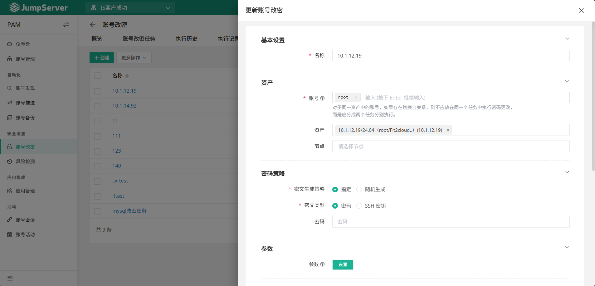

⑤ 风险检测

风险检测功能主要用于识别、评估和响应与特权账户、会话及操作相关的安全风险，主动发现系统的潜在风险，降低内部和外部安全威胁。

■ 实时告警：自动扫描发现僵死账号、异常账号、弱密码账号等异常账号，及时发现潜在的安全风险，提示管理员进行进一步的安全审查；

■ 检测引擎：内置多个不同类型的检测引擎，定时或者周期性扫描账号风险。

图32 在 JumpServer 中创建风险检测任务

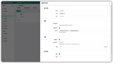

图33 JumpServer 风险扫描结果

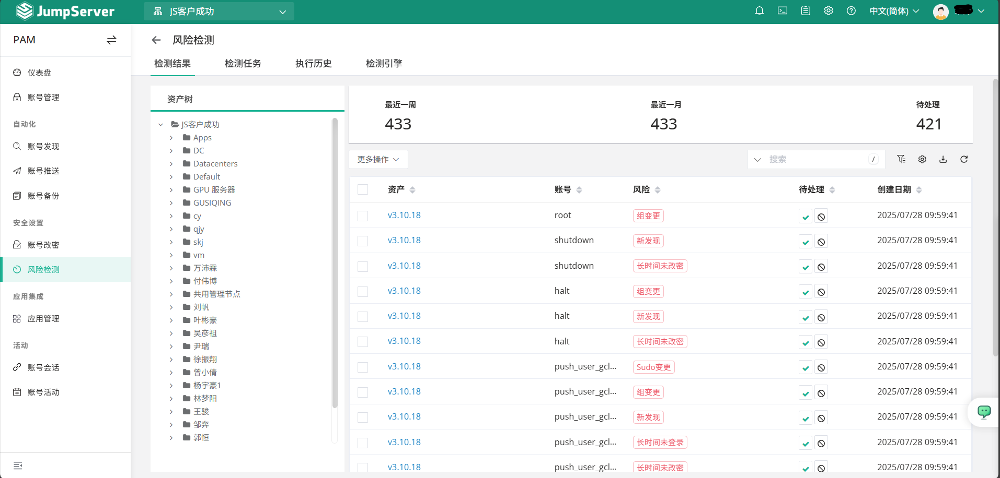

⑥ 应用管理

■ 第三方系统集成：面向第三方系统（例如 CI/CD、监控、运维平台等）提供调用账号和口令 API，杜绝长期有效口令泄露风险。通过 API 接口，第三方系统可以按需安全地获取账号信息，无需长期存储明文密码，降低了密码泄露的风险；

■ 多语言支持与示例代码：为了方便开发者和运维人员集成，JumpServer 提供了多种语言的集成示例代码，支持 Python、Go、Java 等主流编程语言。这些示例代码能够帮助开发者快速实现对 JumpServer API 的调用，进一步简化了集成过程。

图34 在 JumpServer 中创建第三方应用

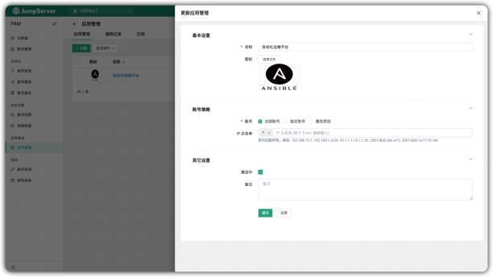

图35 JumpServer 第三方调用说明文档

图36 JumpServer 调用 Demo 展示

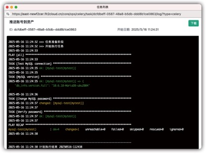

图37 JumpServer 应用调用记录

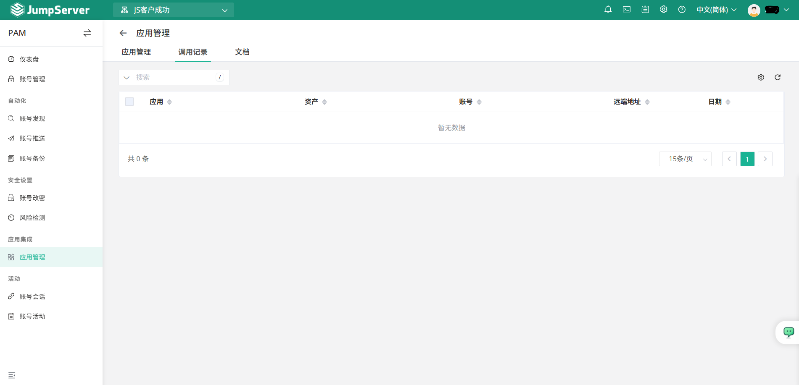
