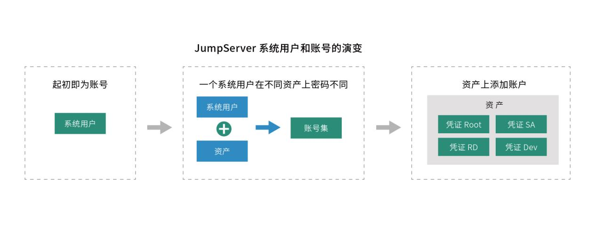
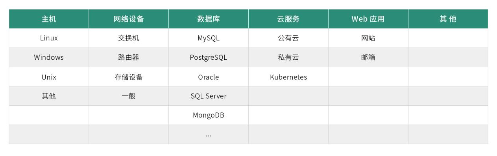
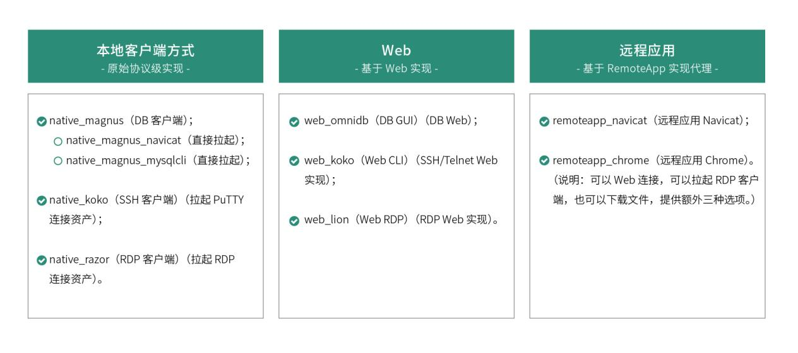
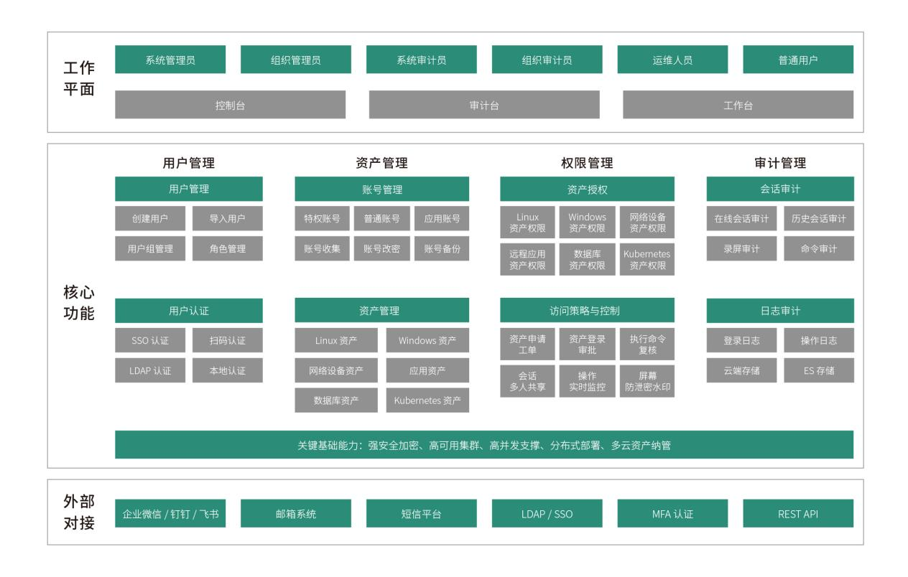

2023 年 2 月 27 日，JumpServer 开源堡垒机 v3.0 版本正式发布。作为 JumpServer 开源项目发展过程中的一个重要的里程碑版本，JumpServer v3.0 版本体现了 JumpServer 产品团队对于新一代堡垒机建设的深入思考，以及关键特性的优化。

## 5.1 发布背景

过去几年里，JumpServer 开源项目一直遵循按月迭代的节奏不断进步。从 2020 年 6 月发布 JumpServer v2.0 版本至今，JumpServer 在 V2 时代累计迭代了 28 个版本。期间，JumpServer 引入了包括数据库审计连接组件 Magnus、Windows RDP 原生连接组件 Razor 等关键组件，在很大程度上优化了产品性能。除此之外，大量功能性和非功能性的优化提升也在同步推进。截至 2023 年 2 月，JumpServer V2 版本已经成为 JumpServer 开源社区内使用最为广泛的版本之一。

在这两年多的时间里，JumpServer 的研发团队意识到 JumpServer 已经逐步发展成为企业内统一运维安全访问和审计的主要入口。与此同时，整个平台的功能和操作复杂度也在提升，在快速的功能迭代过程中存在一些产品设计不合理、冗余的地方，整个系统变得越来越臃肿。因此，是时候对 JumpServer 进行一次“减法”了。

此外，大量社区用户的使用反馈也让 JumpServer 的研发团队收集到了不同规模企业用户关于 JumpServer V2 版本的建议和需求。由于底层架构设计的局限导致部分用户的功能需求在 V2 版本的技术架构下难以实现，于是 JumpServer v3.0 版本的研发规划应运而生，我们决定对 JumpServer 的技术架构进行重构。

显然，JumpServer v3.0 版本的关键目标是通过产品的再设计和优化解决系统平台功能和操作复杂度这一问题，为广大企业用户提供更加卓越的运维安全管理体验。具体来说，这种复杂性主要体现在以下几个方面：

■ JumpServer 的操作主要可以分为两个方面：即面向最终用户的登录访问入口和面向管理人员的资产管理、授权和审计入口。其中，前者从 JumpServer 诞生之日起就一直保持着非常良好的用户使用体验，比如统一的 Web Terminal、广泛支持各种传统访问客户端等。但随着 JumpServer 纳管的资产类型越来越多以及资产规模不断扩张，面向管理人员的日常管理审计操作行为正在变得越来越复杂；

■ 随着 JumpServer 在企业内作为“统一的运维访问入口”定位的确认，企业用户期待在 JumpServer 中加入越来越多的关联功能，并期待这些功能能够灵活地扩展和配置。这也就导致 JumpServer 产品所承载的功能越来越多。这样一来，如何让这些功能更加灵活配置和扩展成为了一个迫在眉睫的问题；

■ 更多的功能和操作必然带来更为复杂的交互设计，而 JumpServer 作为一个企业 IT 部门高频使用的工具软件，用户的使用体验至关重要。任何交互上的不当设计都会给企业日常运维带来很大的使用负担。这就需要 JumpServer 针对不断增加和调整的功能持续进行交互的优化和再设计。

针对以上现实挑战，JumpServer v3.0 版本的设计主要从“对内简化产品设计和提升平台扩展性”和“对外重新设计交互体验”两个方面出发，秉持“内外兼修”的原则，旨在进一步提升用户的使用体验，真正用心做好一款开源堡垒机。

## 5.2 简化产品设计

### 5.2.1 资产和账号进行关联

在过去的版本中，JumpServer 使用“系统用户”来管理运维过程中的登录凭证。系统用户和目标资产是完全解耦的，支持“多对多”映射。系统用户的引入增加了 JumpServer 平台管理的灵活性，同时基于系统用户还增加了大量功能（例如创建账号、用户切换、自动推送、命令过滤、动态用户等）。然而，随着功能的不断增加，系统用户承担了太多的职责，这一设计也带来了管理上的复杂度，需要管理员去多管理一层映射关系，即系统用户与目标资产登录凭证之间的映射。当纳管资产数量和资产登录凭证变多时，系统用户与最终资产登录凭证的映射关系变得错综复杂，越来越难以维护和管理。

为此，在 JumpServer v3.0 版本中，系统用户重构为账号，放弃系统用户中间层。资产登录的验证工作将直接交到目标资产的登录凭证进行管理。用户直接在资产上添加账号，在添加资产时需要添加一系列的凭证来设置账号权限。用户在登录资产时，直接在资产上选择有哪些权限的账号进行登录，省去了原来需要通过系统用户登录的中间步骤。除了指定用户名以外，还设计了包括所有账号、手动账号、同名账号在内的虚拟账号，以对应不同的授权策略，方便管理员快速进行授权。

图16展示了JumpServer在“系统用户和账号”设计上的三个演进阶段：

图16  JumpServer 系统用户和账号的演变

同时，JumpServer v3.0 版本新增“账号管理”模块，通过账号列表可以看到所有的账号，由此可以开展账号收集、账号推送、账号模版、账号改密、账号备份等功能。在比较简单的使用场景中，用户在创建资产时可以选择账号模版，JumpServer 会自动根据模版上的用户名 / 密码创建账号，操作更为快速便捷。

此外，特权账号功能是未来 JumpServer v3.0 版本发展的一个重点，我们也会围绕账号功能展开更多的安全审计工作。

### 5.2.2 资产应用统一纳管

在 JumpServer v3.0 版本中，资产与应用合并统称为“资产”，统一了资产类型。在之前的版本中，JumpServer 对于目标资产的管理，主要分为“资产”和“应用”两类。其中资产主要是指服务器、网络设备等传统目标资产，应用则是包括了数据库、Kubernetes 集群、远程应用等类型。

分类管理目标资产是 JumpServer 持续迭代过程中的一个自然选择。但与此同时，分类管理也带来了资产管理复杂度的提升，系统需要区别对待不同类型的资产。从堡垒机基本理念上来说，系统对目标资产的管理和使用应该是一致的，即满足 4A 标准的运维安全审计规范。为此，JumpServer v3.0 版本重新设计了资产管理功能，统一了所有类型的资产管理接口，并且引入资产类型属性来区分不同的资产。

合并后的资产种类主要包括主机、网络设备、数据库、云服务以及 Web 应用等。其中，每一种类之下又包含了不同的类型，比如：主机类别下包括 Linux、Unix、Windows 和其他资产类型。目前，JumpServer 支持的内置资产类型如图17所示。

图17  JumpServer 支持纳管的资产类型

从图 17 中可以看出，JumpServer v3.0 版本除了支持内置的资产类型外，还支持“其他”资产类型，这说明 JumpServer 具备资产类型的扩展能力。 JumpServer 资产管理的演变历程如图 18 所示。

图18  JumpServer 资产管理的演变历程

## 5.3 提升平台扩展性

### 5.3.1 系统平台重新设计

如前所述，在 JumpServer v3.0 版本中，资产和应用合并，强化了系统平台的作用，来管理不同类型的资产。然而，用户对于堡垒机的资产管理功能，除典型的运维安全审计功能需求外，还期待着大量其他的相关功能（比如账号收集、账号改密等功能），而这些功能则与资产类型密切相关。因此，我们要提升 JumpServer 的功能扩展性，首先需要在资产类型管理上提升其扩展性。为此，JumpServer v3.0 版本对系统平台也进行了重新设计，让其承载更多的扩展性功能，并对资产进行约束。

新旧版本 JumpServer 系统平台的能力差异如图19所示。

图19  JumpServer 系统平台的变化

从图 19 可以看出，原有的 JumpServer 系统平台主要用来区分操作系统、编码差异以及 Windows 配置差异，本质上来说只是起到了标记的作用。而新的 JumpServer 系统平台除了可以区分资产类型外，承载了很多资产管理的功能，还可以定制一些功能，比如资产是否能够开启网域功能、可以进行哪些协议和配置、是否支持账号切换等，这些功能都可以直接在系统平台上进行定义和设置。

另外，通过新的 JumpServer 系统平台，用户可以灵活定义自动化配置，包括资产探活方式、改密方式、账号推送、su 用户切换方式，以及收集账号和资产信息等。未来，我们还会基于平台持续提升 JumpServer 的功能扩展性。

### 5.3.2 远程应用自动部署

作为 JumpServer V2 版本中的重要功能，远程应用的引入极大地拓展了 JumpServer 开源堡垒机可提供的运维安全审计能力。任何可以通过远程应用发布的产品理论上都可以纳入到堡垒机中来，进行日常的运维安全审计管理工作。在 V2 版本中，远程应用被设计为一种独立的应用类型，只是作为 JumpServer 的一种能力存在。然而，随着 JumpServer v3.0 版本中资产和应用的统一，V2 版本的远程应用管理和使用功能被一分为二，目标应用管理变成统一资产管理中的一部分。对目标远程应用的访问（即 RemoteApp 功能）被设计成为一种访问方式来进行管理。因此，在 JumpServer v3.0 版本中，我们对远程应用进行了重新设计。

远程应用是 JumpServer 未来扩展的核心，也是 JumpServer v3.0 版本重构中非常重要的部分。JumpServer 的研发团队非常重视远程应用的重新设计，在 JumpServer v3.0 版本中做了以下重大更新：

■ RemoteApp 远程应用将作为一种连接方式存在，主要用于连接资产，而不再是一种应用类型；

■ RemoteApp 的主机池由 JumpServer 进行统一维护，并且能定时上报状态；

■ 用户提供 Windows 资产并安装基础组件之后，JumpServer 会在应用发布机上代理执行自动化的工作。这样一来，RemoteApp 主机就可以自动部署、自动维护；

■ 密码代填功能使用 Python 框架完成，而不再使用 AutoHotKey，准确性更强；

■ 添加 RemoteApp 类型资产后，需要声明支持的协议。

在新版 JumpServer 中，远程应用自动部署包括了远程应用和应用发布机的一键部署，其中远程应用内置了 Chrome Browser、DBeaver Community、Navicat premium 16（企业版）、MySQL Workbench 8（企业版）等，在连接远程应用时会拉起调用；远程应用发布机是使用远程应用功能时必备的资源，主要用于安装和连接远程应用。

此外， JumpServer v3.0 版本所提供的运维安全审计共有三种连接方式，分别是基于原始协议级别实现的本地客户端连接方式、基于 Web 实现的 Web 连接方式，以及基于 RemoteApp 实现代理的远程应用连接方式。当用户连接资产时，可以根据该资产已有的协议来选择连接方式，系统将会提供多种连接方式供用户选择。

具体来说，这三种资产连接方式的实现如图20所示。

图20  JumpServer 连接方式汇总

## 5.4 用户体验全新升级

在 JumpServer v3.0 版本中，由专业设计师对 JumpServer 的 UI 界面进行了重新设计，操作界面全新升级，仪表盘数据更加直观，整体布局简约清晰，操作体验更加流畅，简约而直白的设计大幅提升了用户的使用体验。

作为一个面向企业用户的专业级运维安全审计产品，JumpServer保持了每一个大版本的迭代进行一次全新UI界面升级的节奏，为用户营造更佳的使用体验。在 JumpServer 的发展历程上有几次大规模的 UI 变化，包括在 v0.3 版本中首次引入 Web UI 界面，在 v1.0 版本中更新了 Web UI 设计，在 v2.0 版本中使用 Vue.js 替代了原来的前端技术。未来，我们还会持续提供不同的主题配色，以满足更多用户的个性化审美需求。

JumpServer 开源堡垒机 v3.0 版本的发布体现了 JumpServer 开源研发团队对于一款“好用的堡垒机”的最新理解与呈现。我们仍会坚持“用心做好一款堡垒机”的初心继续前行，也希望广大社区用户能够继续支持我们，帮助 JumpServer 开源项目不断成长和演进。

图21 JumpServer v3.0 版本操作界面

## 附录 JumpServer 企业版功能架构

历经 9 年迭代，超过 1000 家企业的生产环境验证，能够满足企业级运维安全审计系统的严格要求。

