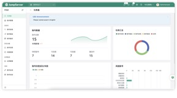
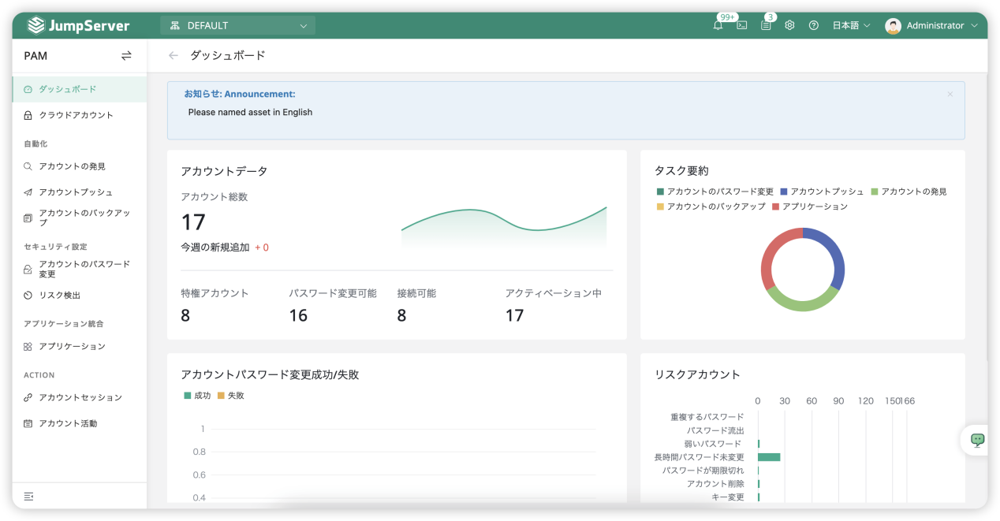

2024 年 7 月 15 日，JumpServer 开源堡垒机发布 v4.0 版本。在 JumpServer 开源堡垒机 v4.0 版本的设计过程中，JumpServer 开源项目组继续秉持“内外兼修”的原则，并且开始迈步走向全球化，同时进一步提升用户的使用体验，真正用心做好一款开源堡垒机。在 v4.0 版本中，JumpServer 项目组对用户使用界面进行了全面的优化升级，并且精心校对了JumpServer的英文界面文案，提升了国际化水平。同时，项目组还整合了 JumpServer 的组件架构，减小了安装包的体积，扩展后端数据库，优化重要功能，旨在提升 JumpServer 运维安全管理平台的易用性、安全性和可靠性。除此之外，新版本的 JumpServer 新增系统组件监控功能，为管理员监控系统日志提供更多便利。

## 6.1 JumpServer v4.10 LTS版本功能

2025 年 5 月 20 日，JumpServer 开源堡垒机正式发布 v4.10 LTS 版本。在经历了十年持续迭代，累计发布 245 个版本之后，JumpServer 迎来了 v4.10 LTS 版本。在 v4.10 LTS 版本中，JumpServer 开源项目组以特权账号管理（即 Privileged Account Management，简称为 PAM）为核心，通过精准身份验证筑牢安全防线，同时进一步提升操作界面的用户使用体验，并且实现多语言适配以及与国际合规标准的对接。JumpServer v4.10 LTS 版本致力于打造集安全、易用、国际化于一体的堡垒机标杆，为企业构建高效、可靠的运维安全审计体系提供坚实的支撑，引领堡垒机行业的持续发展。

## 6.1.1 支持 PAM 特权账号管理

在 JumpServer v4.10 LTS 版本中，JumpServer 以特权账号管理（即 PAM）为核心需求进行架构升级，在完整保留并深度优化原有账号全生命周期管理功能的基础上，突破性地引入账号风险智能检测引擎和应用权限动态管理模块。前者通过行为分析与威胁情报联动，实现特权账号风险的实时评估与预警；后者则基于零信任的架构理念，支持对特权应用进行细粒度的访问控制与权限审计。通过账号风险管控与应用权限管理“双引擎”的协同工作，JumpServer 延续了自身在账号管控领域的传统优势，同时通过智能化安全能力的拓展，为企业构建起覆盖事前、事中以及事后的全方位特权管理防护体系。

图22 JumpServer PAM 特权账号管理

### 6.1.2 支持人脸识别

在 JumpServer v4.10 LTS 版本中，JumpServer 深度整合生物识别技术，将高精度的人脸识别功能融入安全管理全流程。通过 AI算法优化，系统可以实现毫秒级活体检测与身份核验，有效抵御照片、视频攻击，大幅提升账号登录及高危操作的安全性。同时，JumpServer 支持与多因素认证（MFA）的无缝集成，用户可以灵活选择“人脸识别+动态令牌”、“人脸识别+短信验证” 等组合模式，兼顾运维安全审计操作的安全性与便捷性。

图23  JumpServer 人脸识别功能

### 6.1.3 用户使用体验升级

在 JumpServer v4.10 LTS 版本中，JumpServer 开源项目组精心调整了操作界面的字体样式，为用户打造统一且舒适的视觉体验。JumpServer 还重构了客户端界面及相关操作界面，优化 Web 侧各个菜单栏的布局及显示效果，让功能导航更加直观，可操作性更强。同时，资产操作的“增改查”界面重构为抽屉样式，用户操作更加便捷。

### 6.1.4 全面接轨国际化

JumpServer v4.10 LTS 版本支持中文简体、中文繁体、英语、俄语、日语、韩语、巴西葡萄牙语、西班牙语等多语言界面，并且对全语种文案进行了系统性优化与专业校对。从严谨的技术术语到人性化的交互提示，新版本 JumpServer 的多语种操作界面确保了语言表达的准确性，遵从行业规范且符合各地区的文化习惯，大幅提升跨文化场景下的使用体验。JumpServer 正在以兼具标准化与本地化的界面设计与使用体验，加速布局全球市场，为提升国际市场竞争力筑牢根基。

图24 JumpServer 英文界面

图25 JumpServer 日文界面

### 6.1.5 支持 AD、LDAP 目录服务集成

JumpServer v4.10 LTS 版本支持 AD、LDAP 目录服务集成。该功能允许 JumpServer 与企业现有目录服务（例如 Active Directory、LDAP）进行深度对接，从而实现账号的集中管理。通过同步用户身份信息和权限策略，管理员可直接通过 JumpServer控制台授权设备访问，无需在多个系统间切换，大幅提升了运维效率。

### 6.1.6 支持启用 Passkey 作为多因素认证（MFA）方式

Passkey 是基于 WebAuthn 标准的无密码认证技术，通过生物识别技术（例如指纹、面部识别）或安全密钥（例如 USB Key）替代传统密码。启用该功能后，用户在登录 JumpServer 时可以选择 Passkey 作为多因子认证方式，结合生物特征或硬件密钥完成用户身份验证，有效防范密码泄露风险，提升系统的安全性。
